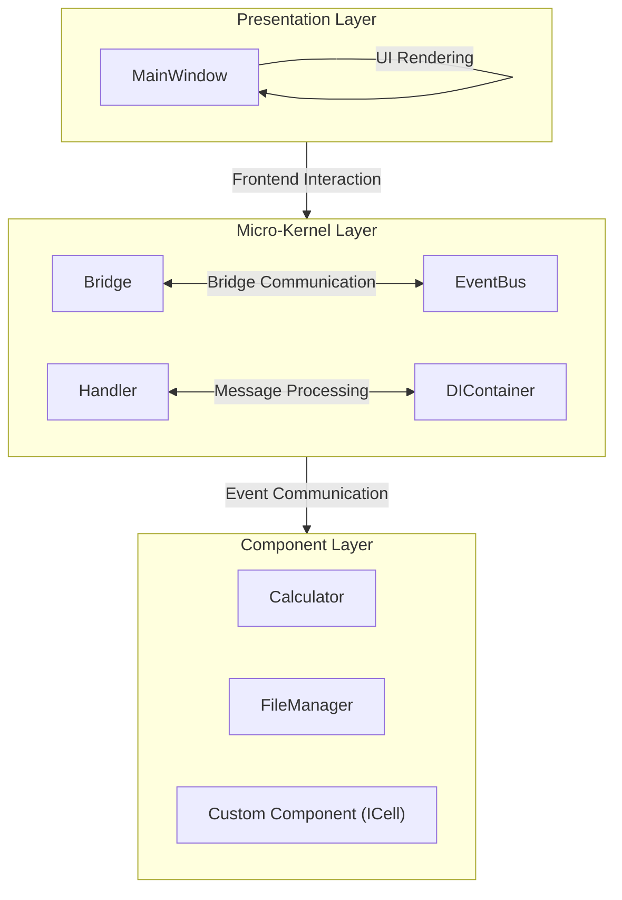
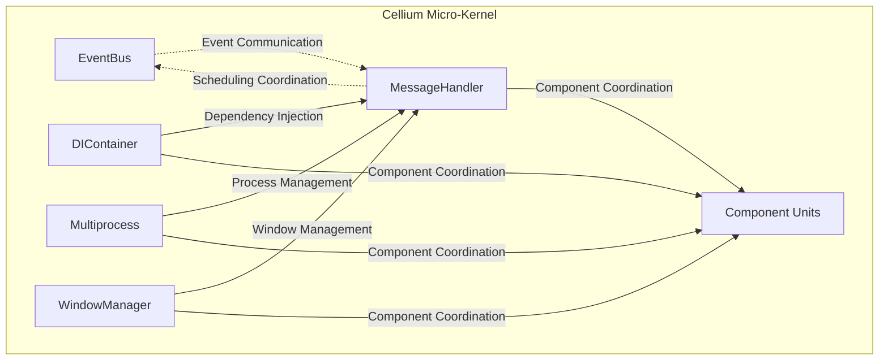

[中文](README.md)

**Documentation Website:** [https://cellium-project.github.io/Cellium/](https://cellium-project.github.io/Cellium/) (Recommended | Better Reading Experience)

**Documentation Navigation:**
- [Component Tutorial](component-tutorial.en.md) | [组件开发教程](component-tutorial.md)
- [Multiprocessing Tutorial](multiprocessing-tutorial.en.md) | [多进程教程](multiprocessing-tutorial.md)
- [Event Mode Tutorial](event-mode-tutorial.en.md) | [事件模式教程](event-mode-tutorial.md)
- [Logging Tutorial](logging-tutorial.en.md) | [日志使用](logging-tutorial.md)

<p align="center">
  
</p>

# Cellium

**Python + HTML/JS Desktop Application Framework.**

Based on "Core-Driven, Module Decoupling" philosophy, connecting Python backend with Web frontend through a lightweight micro-kernel.

| Feature | Description |
|---------|-------------|
| **Core-Driven** | Micro-kernel unified scheduling, developers focus on business logic |
| **Module Decoupling** | Frontend and backend develop independently, communicate via protocol |
| **Simple** | Just write Python functions, frontend calls them |
| **Flexible** | Full Web frontend ecosystem, any UI framework |
| **Lightweight** | Based on MiniBlink, small size, fast startup |

**Compared to Traditional Solutions:**

| Solution | Learning Cost | Development Efficiency | UI Flexibility |
|----------|---------------|------------------------|----------------|
| PyQt/Tkinter | High | Medium | Low |
| Electron | Medium | High | High |
| **Cellium** | **Low** | **High** | **High** |

**Quick Example:**
```python
# app/components/greeter.py
class Greeter(ICell):
    def _cmd_greet(self, text: str = "") -> str:
        return f"{text} Hallo Cellium"
```

```html
<!-- html/index.html -->
<button onclick="window.mbQuery(0, 'greeter:greet:Hello', function(){})">Greet</button>
```

Choose Cellium: **Build desktop apps quickly with your familiar Python and Web technologies.**

## MiniBlink Dependency

Cellium relies on [MiniBlink](https://github.com/weolar/miniblink49) as the WebView engine.

**Download:**

- **Official GitHub Releases**: https://github.com/weolar/miniblink49/releases
- **Daily Build Version**: https://gitcode.com/Resource-Bundle-Collection/68b02

**Placement:**

1. Download the MiniBlink SDK from the above sources (or directly download `mb132_x64.dll`)
2. Copy `mb132_x64.dll` to the `dll/` folder in the project root:

```
python-miniblink/
├── dll/
│   └── mb132_x64.dll    # <-- Place the downloaded DLL here
└── main.py
```

> **Acknowledgments**: Thanks to the [MiniBlink](https://github.com/weolar/miniblink49) team for open-sourcing such a lightweight and high-performance browser engine, enabling developers to easily build desktop applications.

## Table of Contents

- [Documentation](docs/component-tutorial.md)
- [MiniBlink Dependency](#miniblink-dependency)
- [Core Philosophy](#core-philosophy)
- [Architecture Design](#architecture-design)
- [Directory Structure](#directory-structure)
- [Core Modules](#core-modules)
  - [Micro-Kernel Core](#micro-kernel-core)
  - [EventBus](#eventbus)
  - [ICell Interface](#icell-interface)
  - [MessageHandler](#messagehandler)
  - [MiniBlinkBridge](#miniblinkbridge)
  - [Dependency Injection DI](#dependency-injection-di)
- [API Reference](#api-reference)
- [Component Development Guide](#component-development-guide)
  - [Creating New Components](#creating-new-components)
  - [ICell Interface Specification](#icell-interface-specification)
  - [Command Format](#command-format)
- [Configuration Guide](#configuration-guide)
- [Quick Start](#quick-start)

## Core Philosophy

Cellium's design follows the "Core-Driven, Module Decoupling" philosophy, simplifying complex systems into composable Cell Units.

### Core-Driven

The micro-kernel serves as the sole core of the system, responsible for:

- **Command Routing** - Parsing and distributing frontend commands to corresponding components
- **Event Dispatching** - Managing event communication between components
- **Lifecycle Coordination** - Coordinating component loading, initialization, and destruction
- **Resource Management** - Uniformly managing system resources like processes and threads

### Module Decoupling

Each Cell Unit has the following characteristics:

- **Independent Encapsulation** - Components contain complete business logic and state
- **Interface Contracts** - All components implement the unified ICell interface
- **Transparent Communication** - Cross-component communication through the event bus
- **Plug-and-Play** - Configuration-based loading, no need to modify core code

### Frontend-Backend Separation

```mermaid
flowchart TB
    subgraph Frontend["Frontend Layer"]
        H["HTML/CSS"]
        J["JavaScript"]
        MB["window.mbQuery() Call"]
    end

    Core["Cellium Micro-Kernel"]
    
    subgraph Backend["Backend Layer"]
        C["Calculator"]
        F["FileManager"]
        Custom["Custom Component"]
    end

    Frontend -->|window.mbQuery(0, 'cell:command:args')| Core
    Core --> Backend
```

## Architecture Design



### Design Principles

1. **Micro-Kernel Architecture** - Core only handles scheduling and coordination, no business logic
2. **Component Units** - All functionality exists as independent components
3. **Unified Interface** - All components implement ICell interface, following the same contract
4. **Event-Driven** - Components communicate through event bus without direct dependencies
5. **Dependency Injection** - Components don't need to manually import core services, injected automatically for decoupling

### Data Flow

```mermaid
flowchart TD
    A["User Action"] --> B["JavaScript HTML/CSS"]
    B -->|window.mbQuery(0, 'calculator:calc:1+1')| C["MiniBlinkBridge Receives Callback"]
    C --> D["MessageHandler Command Parsing and Routing"]
    
    D --> E{Processing Mode}
    E -->|"Event Mode"| F["EventBus Event"]
    E -->|"Direct Call"| G["Direct Method Call"]
    
    F --> H["Component Processing"]
    G --> I["Return Result"]
    H --> J["Return Result"]
    
    J -->|"→"| K["JavaScript Update UI"]
    I -->|"→"| K
```

## Directory Structure

```
python-miniblink/
├── app/
│   ├── core/                    # Micro-kernel modules
│   │   ├── __init__.py          # Module exports
│   │   ├── bus/                 # Event bus
│   │   │   ├── __init__.py
│   │   │   ├── event_bus.py     # Event bus implementation
│   │   │   ├── events.py        # Event type definitions
│   │   │   └── event_models.py  # Event model definitions
│   │   ├── window/              # Window management
│   │   │   ├── __init__.py
│   │   │   └── main_window.py   # Main window
│   │   ├── bridge/              # Bridge layer
│   │   │   ├── __init__.py
│   │   │   └── miniblink_bridge.py  # MiniBlink communication bridge
│   │   ├── handler/             # Message processing
│   │   │   ├── __init__.py
│   │   │   ├── message_handler.py   # Message handler (command routing)
│   │   │   └── title_bar_handler.py # Title bar handler
│   │   ├── util/                # Utility modules
│   │   │   ├── __init__.py
│   │   │   ├── logger.py        # Logging management
│   │   │   ├── mp_manager.py    # Multiprocess manager
│   │   │   └── components_loader.py  # Component loader
│   │   ├── di/                  # Dependency injection
│   │   │   ├── __init__.py
│   │   │   └── container.py     # DI container
│   │   ├── interface/           # Interface definitions
│   │   │   ├── __init__.py
│   │   │   └── icell.py         # ICell component interface
│   │   └── __init__.py          # Module exports
│   ├── components/              # Component units
│   │   ├── __init__.py
│   │   ├── calculator.py        # Calculator component
│   │   └── greeter.py           # Greeter component
│   └── __init__.py              # Module exports
├── docs/                        # Documentation tutorials
│   ├── index.md                 # Documentation home
│   ├── index.en.md              # Documentation home (English)
│   ├── component-tutorial.md    # Component tutorial
│   ├── component-tutorial.en.md # Component tutorial (English)
│   ├── event-mode-tutorial.md   # Event mode tutorial
│   ├── event-mode-tutorial.en.md # Event mode tutorial (English)
│   ├── multiprocessing-tutorial.md   # Multiprocessing tutorial
│   └── multiprocessing-tutorial.en.md # Multiprocessing tutorial (English)
├── html/                        # HTML resources
│   └── index.html               # Main page
├── font/                        # Font files
├── dll/                         # DLL files
│   └── mb132_x64.dll            # MiniBlink engine
├── config/                      # Configuration files
│   └── settings.yaml            # Component configuration
├── dist/                        # Build output directory
├── main.py                      # Entry file
├── build.bat                    # Build script
├── requirements.txt             # Dependency configuration
└── README.md                    # Documentation
```

## Core Modules

### Micro-Kernel Core

The micro-kernel is Cellium's core scheduler, responsible for coordinating component operations.



### EventBus

The event bus implements decoupled communication between components using the pub-sub pattern.

```python
from app.core import event_bus
from app.core.events import EventType

# Subscribe to events
event_bus.subscribe(EventType.CALC_RESULT, on_calc_result)

# Publish events
event_bus.publish(EventType.CALC_RESULT, result="2")
```

#### Decorator-based Event Subscription (Recommended)

For component development, using decorators is recommended to register event handlers without modifying core code.

```python
from app.core.bus import event, event_once, event_pattern, event_wildcard, register_component_handlers

class MyComponent:
    @event("user.login")
    def on_user_login(self, event_name, **kwargs):
        """Handle user login event"""
        print(f"User logged in: {kwargs.get('username')}")
    
    @event_once("order.completed")
    def on_order_once(self, event_name, **kwargs):
        """One-time event, triggers only once"""
        print("Order completed")
    
    @event_pattern("user.*")
    def on_user_pattern(self, event_name, **kwargs):
        """Pattern matching, matches user.login, user.logout, etc."""
        print(f"User event: {event_name}")
    
    @event_wildcard()
    def on_all_events(self, event_name, **kwargs):
        """Wildcard matching, matches all events"""
        print(f"Received event: {event_name}")

# Automatically register all event handlers in the component
component = MyComponent()
register_component_handlers(component)
```

#### Event Emitter Decorator

Use the `@emitter` decorator to automatically publish events when a method is called.

```python
from app.core.bus import emitter

class OrderService:
    @emitter("order.created")
    def create_order(self, order_id):
        """Automatically publish event after creating order"""
        return f"Order {order_id} created"
```

#### Event Priority

Supports controlling handler execution order by priority, with higher priority handlers executing first.

```python
from app.core.bus import event, EventPriority

class PriorityComponent:
    @event("data.ready", priority=EventPriority.HIGHEST)
    def handler_highest(self, event_name, **kwargs):
        """Highest priority, executes first"""
        print("HIGHEST")
    
    @event("data.ready", priority=EventPriority.HIGH)
    def handler_high(self, event_name, **kwargs):
        """High priority"""
        print("HIGH")
    
    @event("data.ready", priority=EventPriority.NORMAL)
    def handler_normal(self, event_name, **kwargs):
        """Normal priority"""
        print("NORMAL")
    
    @event("data.ready", priority=EventPriority.LOW)
    def handler_low(self, event_name, **kwargs):
        """Low priority"""
        print("LOW")
```

#### Namespace

Use namespaces to avoid event name conflicts, suitable for multi-module collaboration.

```python
from app.core.bus import set_namespace, event

# Set namespace prefix
set_namespace("myapp")

# Event names automatically get prefix: myapp.user.login
class UserModule:
    @event("user.login")
    def on_login(self, event_name, **kwargs):
        print(f"Received: {event_name}")  # Actually receives: myapp.user.login
```

#### Dynamic Subscription

Dynamically subscribe to events at runtime, suitable for scenarios with uncertain event types.

```python
from app.core.bus import subscribe_dynamic, subscribe_pattern_dynamic, subscribe_once_dynamic

def on_dynamic_event(event_name, **kwargs):
    print(f"Dynamic subscription: {event_name}")

# Dynamic subscription
subscribe_dynamic("custom.event", on_dynamic_event)

# Dynamic pattern subscription
subscribe_pattern_dynamic("data.*", on_dynamic_event)

# One-time dynamic subscription
subscribe_once_dynamic("once.event", on_dynamic_event)
```

### ICell Interface

The unified interface specification that all components must implement.

```python
from app.core.interface.icell import ICell

class MyCell(ICell):
    @property
    def cell_name(self) -> str:
        """Component name, used for frontend call identification"""
        return "mycell"
    
    def execute(self, command: str, *args, **kwargs) -> any:
        """Execute command"""
        if command == "greet":
            return f"Hello, {args[0] if args else 'World'}!"
        return f"Unknown command: {command}"
    
    def get_commands(self) -> dict:
        """Get available command list"""
        return {
            "greet": "Greet, e.g., mycell:greet:Alice"
        }
```

### MessageHandler

The message handler acts as a bridge between frontend and backend components, responsible for parsing and routing commands.

```python
class MessageHandler:
    def handle_message(self, message: str) -> str:
        """Handle frontend messages
        
        Supports two formats:
        1. ICell command: 'cell_name:command:args'
        2. Event message: JSON-formatted event data
        """
        if ':' in message:
            # ICell command format
            return self._handle_cell_command(message)
        else:
            # Event message format
            return self._handle_event_message(message)
```

#### Automatic JSON Parsing

MessageHandler automatically detects if Args is JSON format:

- Args starts with `{` → parse as `dict`
- Args starts with `[` → parse as `list`
- Other cases → pass as raw `str`

```javascript
// Simple parameters
window.mbQuery(0, 'greeter:greet:Hello', callback)

// Complex data (automatically parsed as dict)
let userData = JSON.stringify({name: "Alice", age: 25});
window.mbQuery(0, `user:create:${userData}`, callback)
```

```python
# Component receives dict directly, no json.loads needed
def _cmd_create(self, user_data: dict):
    name = user_data.get('name')  # user_data is already a dict
    return f"User {name} created successfully"
```

#### Async Execution Support

For time-consuming operations, use async execution to avoid blocking UI:

```python
# Frontend call with async_exec=True
window.mbQuery(0, 'file:read:C:/large.txt:async', callback)

# Backend automatically submits to thread pool, returns immediately "Task submitted to thread pool"
```

### MiniBlinkBridge

The bridge layer encapsulates communication between Python and the MiniBlink browser engine. Components can interact with the frontend page through the bridge. See [API Reference](#api-reference) for details.

### Dependency Injection DI

The dependency injection container provides automated service injection.

```python
from app.core.di.container import injected, AutoInjectMeta

class Calculator(metaclass=AutoInjectMeta):
    mp_manager = injected(MultiprocessManager)
    event_bus = injected(EventBus)
    
    def calculate(self, expression: str) -> str:
        return self.mp_manager.submit(_calculate_impl, expression)
```

## Component Development Guide

### Creating New Components

Create a new Python file in the `app/components/` directory:

```python
# app/components/filemanager.py
from app.core.interface.icell import ICell

class FileManager(ICell):
    """File Manager Component"""
    
    @property
    def cell_name(self) -> str:
        return "filemanager"
    
    def execute(self, command: str, *args, **kwargs) -> str:
        if command == "read":
            path = args[0] if args else ""
            return self._read_file(path)
        elif command == "write":
            path, content = args[0], args[1] if len(args) > 1 else ""
            return self._write_file(path, content)
        return f"Unknown command: {command}"
    
    def get_commands(self) -> dict:
        return {
            "read": "Read file, e.g., filemanager:read:C:/test.txt",
            "write": "Write file, e.g., filemanager:write:C:/test.txt:content"
        }
    
    def _read_file(self, path: str) -> str:
        """Read file content"""
        with open(path, 'r', encoding='utf-8') as f:
            return f.read()
    
    def _write_file(self, path: str, content: str) -> str:
        """Write file content"""
        with open(path, 'w', encoding='utf-8') as f:
            f.write(content)
        return "Write successful"
```

### ICell Interface Specification

All components must implement the following three methods:

| Method | Return Type | Description |
|--------|-------------|-------------|
| `cell_name` | `str` | Component identifier, lowercase letters |
| `execute(command, *args, **kwargs)` | `Any` | Execute command, return serializable result |
| `get_commands()` | `Dict[str, str]` | Returns {command name: command description} |

## API Reference

This section lists all public APIs of the Cellium framework.

### Dependency Injection DI

The dependency injection container manages components and their dependencies.

```python
from app.core.di.container import injected, DIContainer

class MyComponent:
    mp_manager = injected(MultiprocessManager)
    event_bus = injected(EventBus)
```

#### Core Methods

| Method | Description |
|--------|-------------|
| `register(service_type, instance, singleton=True)` | Register service instance |
| `register_factory(service_type, factory)` | Register factory function |
| `resolve(service_type)` | Get service instance |
| `has(service_type)` | Check if service is registered |
| `clear()` | Clear all registrations |

#### Decorators

| Decorator | Description |
|-----------|-------------|
| `@injected(service_type)` | Property decorator, auto-inject service |
| `@inject(service_type)` | Function parameter decorator |

### MultiprocessManager

The multiprocess manager provides safe code isolation execution.

```python
from app.core import MultiprocessManager

mp_manager = MultiprocessManager()
result = mp_manager.submit(heavy_function, "input_data")
```

#### Core Methods

| Method | Description |
|--------|-------------|
| `submit(func, *args, **kwargs)` | Submit task synchronously, return result |
| `submit_async(func, *args, **kwargs)` | Submit task asynchronously, return Future |
| `map(func, args_list)` | Execute batch synchronously |
| `map_async(func, args_list)` | Execute batch asynchronously |
| `shutdown(wait=True)` | Shutdown process pool |
| `is_enabled()` | Check if enabled |
| `set_enabled(enabled)` | Set enabled state |

#### Helper Functions

| Function | Description |
|----------|-------------|
| `run_in_process(func)` | Decorator, function executes in child process |
| `run_in_process_async(func)` | Decorator, function executes in child process asynchronously |
| `get_multiprocess_manager()` | Get global MultiprocessManager instance |

### MessageHandler

The message handler is responsible for parsing frontend commands and routing to corresponding components.

```python
from app.core import MessageHandler

handler = MessageHandler(hwnd)
handler.register_cell(calculator)
result = handler.handle_message("calculator:calc:1+1")
```

#### Core Methods

| Method | Description |
|--------|-------------|
| `register_cell(cell)` | Register ICell component |
| `get_cell(name)` | Get component by name |
| `register_button_callback(button_id, callback)` | Register button callback |

### MiniBlinkBridge

The bridge layer encapsulates communication between Python and the MiniBlink browser engine.

```python
from app.core import MiniBlinkBridge

# Components get bridge through MainWindow
class MyComponent:
    def __init__(self, bridge):
        self.bridge = bridge
    
    def update_ui(self, value):
        self.bridge.set_element_value('output', value)
```

#### Core Methods

| Method | Description | Example |
|--------|-------------|---------|
| `send_to_js(script)` | Send JS code for execution | `bridge.send_to_js("alert('hi')")` |
| `set_element_value(element_id, value)` | Set element value | `bridge.set_element_value('output', '2')` |
| `get_element_value(element_id, callback)` | Get element value (async) | `bridge.get_element_value('input', callback)` |
| `setup_all_callbacks()` | Setup all MiniBlink callbacks | Call during initialization |

### MainWindow

The main window class manages the application window lifecycle.

```python
from app.core import MainWindow

window = MainWindow()
window.run()
```

#### Core Methods

| Method | Description |
|--------|-------------|
| `run()` | Start window main loop |
| `load_window_icon()` | Load window icon |
| `create_window()` | Create window |
| `init_engine()` | Initialize browser engine |
| `load_dll()` | Load MiniBlink DLL |
| `start_polling()` | Start polling |
| `stop_polling()` | Stop polling |
| `fade_out(duration)` | Window fade out effect |
| `register_button_callback(button_id, callback)` | Register button callback |
| `remove_titlebar()` | Remove title bar |

### ComponentsLoader

The component loader is responsible for loading components from configuration files.

```python
from app.core.util.components_loader import load_components, load_component_config

# Load configuration
config = load_component_config(config_path)

# Load components
components = load_components(container, debug=True)
```

#### Core Functions

| Function | Description |
|----------|-------------|
| `load_component_config(config_path)` | Load YAML configuration file |
| `load_components(container, debug)` | Load components based on configuration |
| `dynamic_import(module_path)` | Import module dynamically |

### Command Format

Frontend calls components through the `window.mbQuery()` function:

```javascript
// Calculate expression
window.mbQuery(0, 'calculator:calc:1+1', function(customMsg, response) {
    console.log(response);
})

// Read file
window.mbQuery(0, 'filemanager:read:C:/test.txt', function(customMsg, response) {
    console.log(response);
})

// Write file
window.mbQuery(0, 'filemanager:write:C:/test.txt:Hello World', function(customMsg, response) {
    console.log(response);
})

// Call custom component
window.mbQuery(0, 'mycell:greet:Cellium', function(customMsg, response) {
    console.log(response);
})
```

## Configuration Guide

Components are managed through `config/settings.yaml` configuration file:

```yaml
# config/settings.yaml
enabled_components:
  - app.components.calculator.Calculator
  - app.components.filemanager.FileManager
  # - app.components.debug.DebugTool  <-- Comment to not load
```

### Auto-Discovery

Cellium supports two component loading methods:

**1. Configuration Loading (Current Default)**

Explicitly declare components to load in the configuration file:

```yaml
enabled_components:
  - app.components.calculator.Calculator
```

**2. Auto-Discovery (Optional)**

Configure automatic scanning of the `app/components/` directory to discover and load all ICell implementations:

```yaml
auto_discover: true
scan_paths:
  - app.components
```

## Quick Start

### 1. Run Application

```python
from app.core import MainWindow

def main():
    window = MainWindow()
    window.run()

if __name__ == "__main__":
    main()
```

### 2. Frontend Calls Component

```javascript
// In HTML/JavaScript
<button onclick="window.mbQuery(0, 'calculator:calc:1+1', function(customMsg, response){ document.getElementById('result').innerText = response; })">Calculate 1+1</button>
<button onclick="window.mbQuery(0, 'calculator:calc:2*3', function(customMsg, response){ document.getElementById('result').innerText = response; })">Calculate 2*3</button>
```

### 3. View Component List

All loaded components and their commands are displayed in the startup log:

```
[INFO] Loaded component: Calculator (cell_name: calculator)
[INFO] Loaded component: FileManager (cell_name: filemanager)
```

## Extension Guide

### Adding Async Components

Components support async execution:

```python
import asyncio
from app.core.interface.icell import ICell

class AsyncCell(ICell):
    @property
    def cell_name(self) -> str:
        return "async"
    
    async def execute(self, command: str, *args, **kwargs) -> str:
        if command == "fetch":
            return await self._async_fetch(args[0] if args else "")
        return f"Unknown command: {command}"
    
    async def _async_fetch(self, url: str) -> str:
        # Async operation
        await asyncio.sleep(1)
        return f"Fetched: {url}"
    
    def get_commands(self) -> dict:
        return {
            "fetch": "Fetch data async, e.g., async:fetch:https://example.com"
        }
```

### Component Communication

Communicate between components through the event bus:

```python
from app.core import event_bus
from app.core.events import EventType

class CellA(ICell):
    def execute(self, command: str, *args, **kwargs) -> str:
        if command == "notify":
            event_bus.publish(EventType.CUSTOM_NOTIFY, message=args[0])
            return "Notification sent"
        return "Unknown command"
    
    def get_commands(self) -> dict:
        return {"notify": "Send notification"}


class CellB(ICell):
    def __init__(self):
        event_bus.subscribe(EventType.CUSTOM_NOTIFY, self._on_notify)
    
    def _on_notify(self, event):
        print(f"Received notification: {event.data}")
    
    # ... Other ICell methods
```

### Resource Path Management

```python
from app.core.util import get_project_root

# Get project root directory
root = get_project_root()

# Resource paths
dll_path = root / "dll" / "mb132_x64.dll"
html_path = root / "html" / "index.html"
```

## Best Practices

1. **Keep Components Independent** - Each component should focus on a single function
2. **Follow ICell Specification** - Correctly implement cell_name, execute, get_commands
3. **Use Dependency Injection** - Use injected to get services, avoid hardcoded dependencies
4. **Handle Exceptions** - Catch exceptions in execute and return error messages
5. **Return Serializable Results** - Ensure returned results can be JSON serialized
