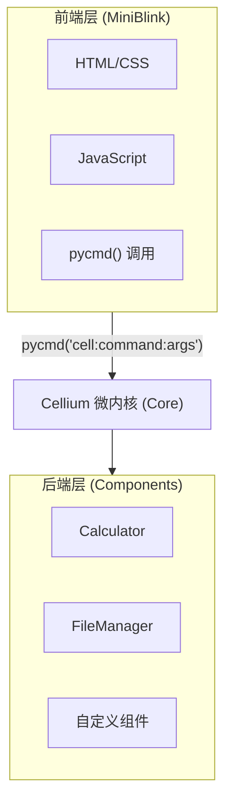
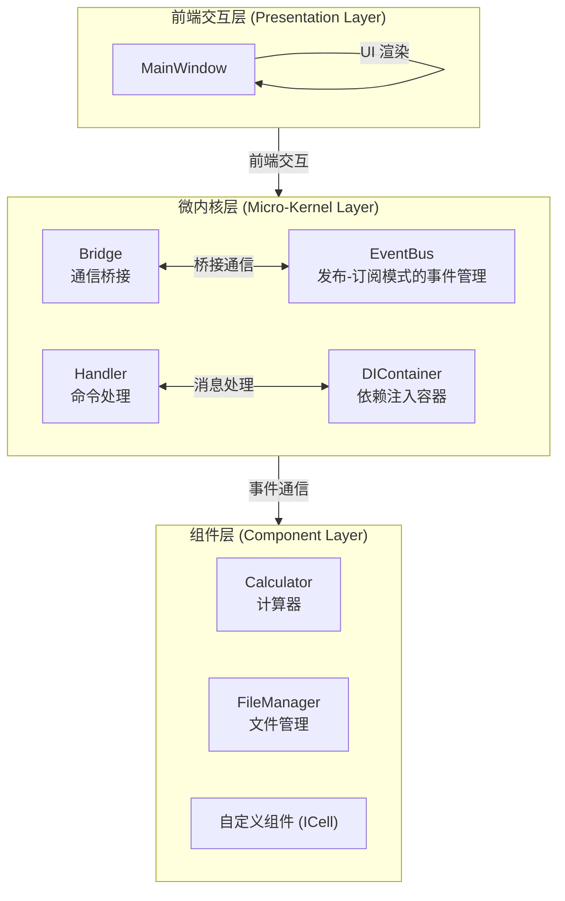
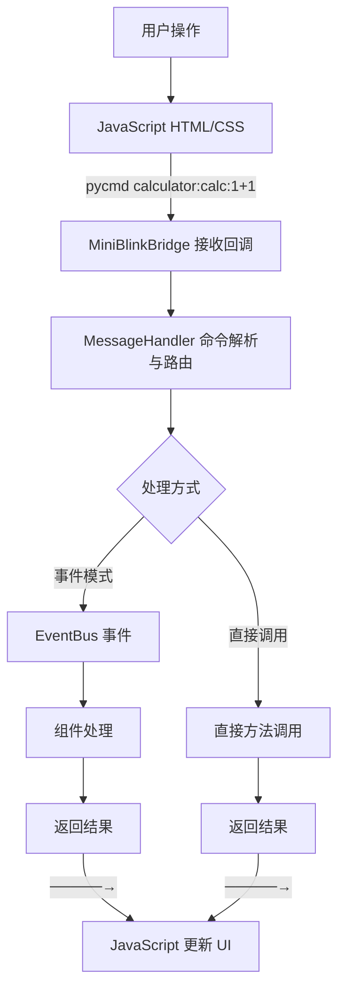
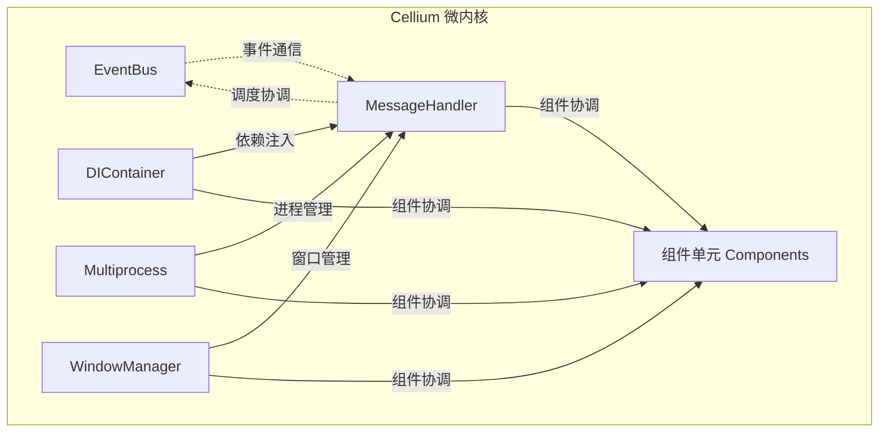

[English](README.en.md) | [教程](docs/component-tutorial.md) | [English Tutorial](docs/component-tutorial.en.md)

<p align="center">
  
</p>

# Cellium

**Python + HTML/JS 的桌面应用框架。**

基于"核心驱动-模块解耦"理念的 Python 桌面应用框架。

通过一个精密的微内核（Core）作为调度中枢，实现了前端交互与后端逻辑的彻底分离。开发者只需将功能封装为独立的"细胞单元"，其余的跨模块通信、并发调度与资源管理均由 Cellium 核心透明完成，让复杂的系统构建变得像拼图一样简单。

| 特点 | 说明 |
|------|------|
| **核心驱动** | 微内核统一调度，开发者只需关注业务逻辑 |
| **模块解耦** | 前后端独立开发，通过协议通信 |
| **简单** | 只需写 Python 函数定义功能，前端调用即可 |
| **灵活** | 完整 Web 前端生态，任意 UI 框架 |
| **轻量** | 基于 MiniBlink，体积小、启动快 |

**对比传统方案：**

| 方案 | 学习成本 | 开发效率 | UI 灵活性 |
|------|---------|---------|----------|
| PyQt/Tkinter | 高 | 中 | 低 |
| Electron | 中 | 高 | 高 |
| **Cellium** | **低** | **高** | **高** |

**快速示例：**
```python
# app/components/greeter.py
class Greeter(ICell):
    def _cmd_greet(self, text: str = "") -> str:
        return f"{text} Hallo Cellium"
```

```html
<!-- html/index.html -->
<button onclick="pycmd('greeter:greet:你好')">问候</button>
```

选择 Cellium：**用你熟悉的 Python 和 Web 技术，快速构建桌面应用。**

## MiniBlink 依赖

Cellium 依赖 [MiniBlink](https://github.com/weolar/miniblink49) 作为 WebView 引擎。

**下载地址：**

- **官方 GitHub Releases**: https://github.com/weolar/miniblink49/releases
- **每日构建版本**: https://gitcode.com/Resource-Bundle-Collection/68b02

**放置方法：**

1. 从上述地址下载 MiniBlink SDK（或直接下载 `mb132_x64.dll`）
2. 将 `mb132_x64.dll` 复制到项目根目录的 `dll/` 文件夹中：

```
python-miniblink/
├── dll/
│   └── mb132_x64.dll    # <-- 将下载的 DLL 放在这里
└── main.py
```

> **感谢**：感谢 [MiniBlink](https://github.com/weolar/miniblink49) 团队开源如此轻量级、高性能的浏览器引擎，让开发者能够轻松构建桌面应用。

## 目录

- [文档](docs/component-tutorial.md)
- [MiniBlink 依赖](#miniblink-依赖)
- [核心理念](#核心理念)
- [架构设计](#架构设计)
- [目录结构](#目录结构)
- [核心模块](#核心模块)
  - [微内核 Core](#微内核-core)
  - [事件总线 EventBus](#事件总线-eventbus)
  - [组件接口 ICell](#组件接口-icell)
  - [消息处理器 MessageHandler](#消息处理器-messagehandler)
  - [桥接层 MiniBlinkBridge](#桥接层-miniblinkbridge)
  - [依赖注入 DI](#依赖注入-di)
- [API 参考](#api-参考)
- [组件开发指南](#组件开发指南)
  - [创建新组件](#创建新组件)
  - [ICell 接口规范](#icell-接口规范)
  - [命令调用格式](#命令调用格式)
- [配置指南](#配置指南)
- [快速开始](#快速开始)

## 核心理念

Cellium 的设计遵循"核心驱动-模块解耦"的核心哲学，将复杂系统简化为可组合的细胞单元。

### 核心驱动

微内核作为系统的唯一核心，负责：

- **命令路由** - 解析并分发前端命令到对应组件
- **事件调度** - 管理组件间的事件通信
- **生命周期** - 协调组件的加载、初始化和销毁
- **资源管理** - 统一管理多进程、线程等系统资源

### 模块解耦

每个组件单元（Cell）具有以下特性：

- **独立封装** - 组件包含完整的业务逻辑和状态
- **接口契约** - 所有组件实现统一的 ICell 接口
- **透明通信** - 通过事件总线进行跨组件通信
- **即插即用** - 配置即加载，无须修改核心代码

### 前端后端分离



## 架构设计



### 设计原则

1. **微内核架构** - 核心只负责调度和协调，不包含业务逻辑
2. **组件单元** - 所有功能以独立组件形式存在
3. **统一接口** - 所有组件实现 ICell 接口，遵循相同契约
4. **事件驱动** - 组件间通过事件总线通信，互不直接依赖
5. **依赖注入** - 组件无需手动导入核心服务，自动注入解耦

### 数据流向



## 目录结构

```
cellium/
├── app/
│   ├── core/                    # 微内核模块
│   │   ├── __init__.py          # 模块导出
│   │   ├── bus/                 # 事件总线
│   │   │   ├── __init__.py
│   │   │   └── event_bus.py     # 事件总线实现
│   │   ├── window/              # 窗口管理
│   │   │   ├── __init__.py
│   │   │   └── main_window.py   # 主窗口
│   │   ├── bridge/              # 桥接层
│   │   │   ├── __init__.py
│   │   │   └── miniblink_bridge.py  # MiniBlink 通信桥接
│   │   ├── handler/             # 消息处理
│   │   │   ├── __init__.py
│   │   │   └── message_handler.py   # 消息处理器（命令路由）
│   │   ├── util/                # 工具模块
│   │   │   ├── __init__.py
│   │   │   ├── logger.py        # 日志管理
│   │   │   ├── mp_manager.py    # 多进程管理器
│   │   │   └── components_loader.py  # 组件加载器
│   │   ├── di/                  # 依赖注入
│   │   │   ├── __init__.py
│   │   │   └── container.py     # DI 容器
│   │   ├── interface/           # 接口定义
│   │   │   ├── __init__.py
│   │   │   └── icell.py         # ICell 组件接口
│   │   ├── events.py            # 事件类型定义
│   │   └── event_models.py      # 事件模型定义
│   ├── components/                   # 组件单元
│   │   ├── __init__.py
│   │   └── calculator.py        # 计算器组件
│   └── __init__.py              # 应用入口
├── html/                        # HTML 资源
│   └── index.html               # 主页面
├── font/                        # 字体文件
├── dll/                         # DLL 文件
│   └── mb132_x64.dll            # MiniBlink 引擎
├── app_icon.ico                 # 应用图标
├── config/                      # 配置文件
│   └── settings.yaml            # 组件配置
├── dist/                        # 构建输出目录
├── main.py                      # 入口文件
├── build.bat                    # 构建脚本
├── requirements.txt             # 依赖配置
└── README.md                    # 文档
```

## 核心模块

### 微内核 Core

微内核是 Cellium 的核心调度器，负责协调各组件工作。



### 事件总线 EventBus

事件总线实现组件间的解耦通信，采用发布-订阅模式。

```python
from app.core import event_bus
from app.core.events import EventType

# 订阅事件
event_bus.subscribe(EventType.CALC_RESULT, on_calc_result)

# 发布事件
event_bus.publish(EventType.CALC_RESULT, result="2")
```

### 组件接口 ICell

所有组件必须实现的统一接口规范。

```python
from app.core.interface.icell import ICell

class MyCell(ICell):
    @property
    def cell_name(self) -> str:
        """组件名称，用于前端调用标识"""
        return "mycell"
    
    def execute(self, command: str, *args, **kwargs) -> any:
        """执行命令"""
        if command == "greet":
            return f"Hello, {args[0] if args else 'World'}!"
        return f"Unknown command: {command}"
    
    def get_commands(self) -> dict:
        """获取可用命令列表"""
        return {
            "greet": "打招呼，例如: mycell:greet:Alice"
        }
```

### 消息处理器 MessageHandler

消息处理器是前端与后端组件的桥梁，负责解析和路由命令。

```python
class MessageHandler:
    def handle_message(self, message: str) -> str:
        """处理前端消息
        
        支持两种格式：
        1. ICell 命令: 'cell_name:command:args'
        2. 事件消息: JSON 格式的事件数据
        """
        if ':' in message:
            # ICell 命令格式
            return self._handle_cell_command(message)
        else:
            # 事件消息格式
            return self._handle_event_message(message)
```

### 桥接层 MiniBlinkBridge

桥接层封装 Python 与 MiniBlink 浏览器引擎之间的通信，组件可通过 bridge 与前端页面交互。详见 [API 参考](#api-参考)。

### 依赖注入 DI

依赖注入容器提供自动化的服务注入。

```python
from app.core.di.container import injected, AutoInjectMeta

class Calculator(metaclass=AutoInjectMeta):
    mp_manager = injected(MultiprocessManager)
    event_bus = injected(EventBus)
    
    def calculate(self, expression: str) -> str:
        return self.mp_manager.submit(_calculate_impl, expression)
```

## 组件开发指南

### 创建新组件

在 `app/components/` 目录下创建新的 Python 文件：

```python
# app/components/filemanager.py
from app.core.interface.icell import ICell

class FileManager(ICell):
    """文件管理组件"""
    
    @property
    def cell_name(self) -> str:
        return "filemanager"
    
    def execute(self, command: str, *args, **kwargs) -> str:
        if command == "read":
            path = args[0] if args else ""
            return self._read_file(path)
        elif command == "write":
            path, content = args[0], args[1] if len(args) > 1 else ""
            return self._write_file(path, content)
        return f"Unknown command: {command}"
    
    def get_commands(self) -> dict:
        return {
            "read": "读取文件，例如: filemanager:read:C:/test.txt",
            "write": "写入文件，例如: filemanager:write:C:/test.txt:内容"
        }
    
    def _read_file(self, path: str) -> str:
        """读取文件内容"""
        with open(path, 'r', encoding='utf-8') as f:
            return f.read()
    
    def _write_file(self, path: str, content: str) -> str:
        """写入文件内容"""
        with open(path, 'w', encoding='utf-8') as f:
            f.write(content)
        return "Write successful"
```

### ICell 接口规范

所有组件必须实现以下三个方法：

| 方法 | 返回类型 | 说明 |
|------|---------|------|
| `cell_name` | `str` | 组件唯一标识，小写字母 |
| `execute(command, *args, **kwargs)` | `Any` | 执行命令，返回可序列化结果 |
| `get_commands()` | `Dict[str, str]` | 返回 {命令名: 命令描述} |

## API 参考

本节列出 Cellium 框架的所有公共 API。

### 事件总线 EventBus

事件总线提供组件间的解耦通信机制。

```python
from app.core import event_bus, EventType

# 订阅事件
def on_calc_result(result):
    print(f"计算结果: {result}")

event_bus.subscribe(EventType.CALC_RESULT, on_calc_result)

# 发布事件
event_bus.publish(EventType.CALC_RESULT, result="2")
```

#### 核心方法

| 方法 | 说明 |
|------|------|
| `subscribe(event_type, handler)` | 订阅事件，handler 为回调函数 |
| `publish(event_type, *args, **kwargs)` | 发布事件，触发所有订阅者 |
| `unsubscribe(event_type, handler)` | 取消订阅 |
| `register_event_class(event_type, event_class)` | 注册事件类 |
| `has_subscribers(event_type)` | 检查是否有订阅者 |
| `clear()` | 清空所有订阅 |
| `get_subscribers_count(event_type)` | 获取订阅者数量 |

#### 事件类型 EventType

| 事件类型 | 说明 |
|---------|------|
| `EventType.NAVIGATION` | 页面导航事件 |
| `EventType.ALERT` | Alert 弹窗事件 |
| `EventType.JSQUERY` | JsQuery 查询事件 |
| `EventType.FADE_OUT` | 窗口淡出事件 |
| `EventType.WINDOW_RESIZE` | 窗口大小变化事件 |
| `EventType.WINDOW_MOVE` | 窗口移动事件 |
| `EventType.BUTTON_CLICK` | 按钮点击事件 |
| `EventType.CALC_RESULT` | 计算器结果事件 |
| `EventType.SYSTEM_COMMAND` | 系统命令事件 |

#### 事件模型

| 类 | 说明 | 属性 |
|---|------|------|
| `NavigationEvent` | 导航事件 | `navigation_type`, `url` |
| `AlertEvent` | Alert 事件 | `message` |
| `JsQueryEvent` | JsQuery 事件 | `webview`, `query_id`, `custom_msg`, `message` |

### 依赖注入 DI

依赖注入容器管理组件及其依赖关系。

```python
from app.core.di.container import injected, DIContainer

class MyComponent:
    mp_manager = injected(MultiprocessManager)
    event_bus = injected(EventBus)
```

#### 核心方法

| 方法 | 说明 |
|------|------|
| `register(service_type, instance, singleton=True)` | 注册服务实例 |
| `register_factory(service_type, factory)` | 注册工厂函数 |
| `resolve(service_type)` | 获取服务实例 |
| `has(service_type)` | 检查服务是否已注册 |
| `clear()` | 清空所有注册 |

#### 装饰器

| 装饰器 | 说明 |
|--------|------|
| `@injected(service_type)` | 属性装饰器，自动注入服务 |
| `@inject(service_type)` | 函数参数装饰器 |

### 多进程管理 MultiprocessManager

多进程管理器提供安全的代码隔离执行。

```python
from app.core import MultiprocessManager

mp_manager = MultiprocessManager()
result = mp_manager.submit(heavy_function, "input_data")
```

#### 核心方法

| 方法 | 说明 |
|------|------|
| `submit(func, *args, **kwargs)` | 同步提交任务，返回结果 |
| `submit_async(func, *args, **kwargs)` | 异步提交任务，返回 Future |
| `map(func, args_list)` | 同步批量执行 |
| `map_async(func, args_list)` | 异步批量执行 |
| `shutdown(wait=True)` | 关闭进程池 |
| `is_enabled()` | 检查是否启用 |
| `set_enabled(enabled)` | 设置启用状态 |

#### 辅助函数

| 函数 | 说明 |
|------|------|
| `run_in_process(func)` | 装饰器，函数在子进程执行 |
| `run_in_process_async(func)` | 装饰器，函数在子进程异步执行 |
| `get_multiprocess_manager()` | 获取全局 MultiprocessManager 实例 |

### 消息处理器 MessageHandler

消息处理器负责解析前端命令并路由到对应组件。

```python
from app.core import MessageHandler

handler = MessageHandler(hwnd)
handler.register_cell(calculator)
result = handler.handle_message("calculator:calc:1+1")
```

#### 核心方法

| 方法 | 说明 |
|------|------|
| `register_cell(cell)` | 注册 ICell 组件 |
| `get_cell(name)` | 根据名称获取组件 |
| `register_button_callback(button_id, callback)` | 注册按钮回调 |

### 桥接层 MiniBlinkBridge

桥接层封装 Python 与 MiniBlink 浏览器引擎的通信。

```python
from app.core import MiniBlinkBridge

# 组件中通过 MainWindow 获取 bridge
class MyComponent:
    def __init__(self, bridge):
        self.bridge = bridge
    
    def update_ui(self, value):
        self.bridge.set_element_value('output', value)
```

#### 核心方法

| 方法 | 说明 | 示例 |
|------|------|------|
| `send_to_js(script)` | 发送 JS 代码执行 | `bridge.send_to_js("alert('hi')")` |
| `set_element_value(element_id, value)` | 设置元素值 | `bridge.set_element_value('output', '2')` |
| `get_element_value(element_id, callback)` | 获取元素值（异步） | `bridge.get_element_value('input', callback)` |
| `setup_all_callbacks()` | 设置所有 MiniBlink 回调 | 初始化时调用 |

### 主窗口 MainWindow

主窗口类管理应用窗口生命周期。

```python
from app.core import MainWindow

window = MainWindow()
window.run()
```

#### 核心方法

| 方法 | 说明 |
|------|------|
| `run()` | 启动窗口主循环 |
| `load_window_icon()` | 加载窗口图标 |
| `create_window()` | 创建窗口 |
| `init_engine()` | 初始化浏览器引擎 |
| `load_dll()` | 加载 MiniBlink DLL |
| `start_polling()` | 启动轮询 |
| `stop_polling()` | 停止轮询 |
| `fade_out(duration)` | 窗口淡出效果 |
| `register_button_callback(button_id, callback)` | 注册按钮回调 |
| `remove_titlebar()` | 移除标题栏 |

### 组件加载器 ComponentsLoader

组件加载器负责从配置文件加载组件。

```python
from app.core.util.components_loader import load_components, load_component_config

# 加载配置
config = load_component_config(config_path)

# 加载组件
components = load_components(container, debug=True)
```

#### 核心函数

| 函数 | 说明 |
|------|------|
| `load_component_config(config_path)` | 加载 YAML 配置文件 |
| `load_components(container, debug)` | 根据配置加载组件 |
| `dynamic_import(module_path)` | 动态导入模块 |

### 命令调用格式

前端通过 `pycmd()` 函数调用组件：

```javascript
// 计算表达式
pycmd('calculator:calc:1+1')

// 读取文件
pycmd('filemanager:read:C:/test.txt')

// 写入文件
pycmd('filemanager:write:C:/test.txt:Hello World')

// 调用自定义组件
pycmd('mycell:greet:Cellium')
```

## 配置指南

组件通过 `config/settings.yaml` 配置文件管理：

```yaml
# config/settings.yaml
enabled_components:
  - app.components.calculator.Calculator
  - app.components.filemanager.FileManager
  # - app.components.debug.DebugTool  <-- 注释则不加载
```

### 自动发现

Cellium 支持两种组件加载方式：

**1. 配置加载（当前默认）**

在配置文件中显式声明要加载的组件：

```yaml
enabled_components:
  - app.components.calculator.Calculator
```

**2. 自动扫描（可选）**

配置自动扫描 `app/components/` 目录，发现并加载所有 ICell 实现：

```yaml
auto_discover: true
scan_paths:
  - app.components
```

## 快速开始

### 1. 运行应用

```python
from app.core import MainWindow

def main():
    window = MainWindow()
    window.run()

if __name__ == "__main__":
    main()
```

### 2. 前端调用组件

```javascript
// 在 HTML/JavaScript 中
<button onclick="pycmd('calculator:calc:1+1')">计算 1+1</button>
<button onclick="pycmd('calculator:calc:2*3')">计算 2*3</button>
```

### 3. 查看组件列表

所有已加载的组件及其命令会在启动日志中显示：

```
[INFO] 已加载组件: Calculator (cell_name: calculator)
[INFO] 已加载组件: FileManager (cell_name: filemanager)
```

## 扩展指南

### 添加异步组件

组件支持异步执行：

```python
import asyncio
from app.core.interface.icell import ICell

class AsyncCell(ICell):
    @property
    def cell_name(self) -> str:
        return "async"
    
    async def execute(self, command: str, *args, **kwargs) -> str:
        if command == "fetch":
            return await self._async_fetch(args[0] if args else "")
        return f"Unknown command: {command}"
    
    async def _async_fetch(self, url: str) -> str:
        # 异步操作
        await asyncio.sleep(1)
        return f"Fetched: {url}"
    
    def get_commands(self) -> dict:
        return {
            "fetch": "异步获取数据，例如: async:fetch:https://example.com"
        }
```

### 组件间通信

通过事件总线进行组件间通信：

```python
from app.core import event_bus
from app.core.events import EventType

class CellA(ICell):
    def execute(self, command: str, *args, **kwargs) -> str:
        if command == "notify":
            event_bus.publish(EventType.CUSTOM_NOTIFY, message=args[0])
            return "Notification sent"
        return "Unknown command"
    
    def get_commands(self) -> dict:
        return {"notify": "发送通知"}


class CellB(ICell):
    def __init__(self):
        event_bus.subscribe(EventType.CUSTOM_NOTIFY, self._on_notify)
    
    def _on_notify(self, event):
        print(f"收到通知: {event.data}")
    
    # ... 其他 ICell 方法
```

### 资源路径管理

```python
from app.core.util import get_project_root

# 获取项目根目录
root = get_project_root()

# 资源路径
dll_path = root / "dll" / "mb132_x64.dll"
html_path = root / "html" / "index.html"
```

## 最佳实践

1. **保持组件独立** - 每个组件应专注于单一功能
2. **遵循 ICell 规范** - 正确实现 cell_name、execute、get_commands
3. **使用依赖注入** - 通过 injected 获取服务，避免硬编码依赖
4. **处理异常** - 在 execute 中捕获异常并返回错误信息
5. **返回可序列化结果** - 确保返回结果可以被 JSON 序列化


