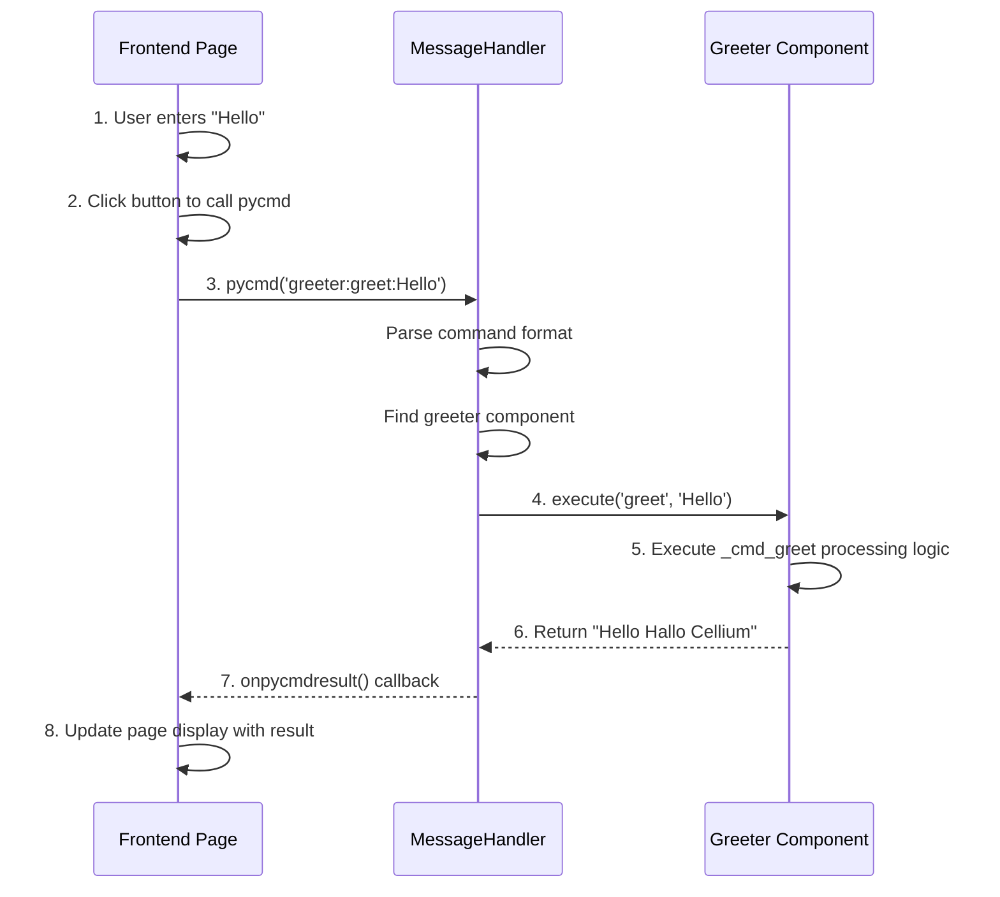

# Cellium Component Development Tutorial

[中文](component-tutorial.md) | [Back to Main](../README.md) | [中文主文档](../README.md)

> **"In Cellium, writing a feature module is as natural as writing a simple Python function, and the complex communication is handled by the microkernel."**

This tutorial demonstrates how to create a Cellium component from scratch using a complete example. We will build a "Greeter Component" that receives text input from the frontend, appends "Hallo Cellium" suffix, and returns the result for display.

## 1. Cellium Communication Protocol

Before coding, let's understand Cellium's core communication protocol. All cross-layer communication follows the "Cell Addressing Protocol":

```
pycmd('cell:command:args')
```

| Component | Description | Example |
|-----------|-------------|---------|
| **Cell** | Target cell name (component identifier) | `greeter` |
| **Command** | Action to be executed by the cell | `greet` |
| **Args** | Arguments passed to the action (**passed as a single string**) | `Hello` |

**Protocol Examples:**
```
# Send greet command to greeter component with argument "Hello"
pycmd('greeter:greet:Hello')

# Send calc command to calculator component with expression "1+1"
pycmd('calculator:calc:1+1')

# Pass arguments containing colons (e.g., file paths)
pycmd('filemanager:read:C:/test.txt')
```

> 💡 **Args Note**: The argument portion is passed as a single string. If you need to pass multiple arguments, parse them within the component (e.g., using `args.split(':')`).

This concise protocol design makes frontend-backend communication intuitive and powerful.

## 2. Create Component File

Create a new file `greeter.py` in the `app/components/` directory:

```python
# app/components/greeter.py
# -*- coding: utf-8 -*-
"""
Greeter Component Example

Demonstrates basic Cellium framework usage:
1. Frontend sends text to backend
2. Backend processes and appends suffix
3. Frontend updates display with result
"""

from app.core.interface.icell import ICell


class Greeter(ICell):
    """Greeter component: receives text, appends suffix, and returns"""

    @property
    def cell_name(self) -> str:
        """Component identifier used for frontend calls"""
        return "greeter"

    def execute(self, command: str, *args, **kwargs):
        """Automatically maps commands to methods starting with _cmd_"""
        method_name = f"_cmd_{command}"
        if hasattr(self, method_name):
            method = getattr(self, method_name)
            return method(*args, **kwargs)
        return f"Cell '{self.cell_name}' has no command: {command}"

    def get_commands(self) -> dict:
        """Returns available command list"""
        return {
            "greet": "Add greeting suffix, e.g., greeter:greet:Hello"
        }

    def _cmd_greet(self, text: str = "") -> str:
        """Add Hallo Cellium suffix"""
        if not text:
            return "Hallo Cellium"
        return f"{text} Hallo Cellium"
```

## 2. Component Structure Analysis

Each Cellium component must inherit from the `ICell` interface and implement three core methods:

| Method | Description |
|--------|-------------|
| `cell_name` | Component identifier (lowercase), used for frontend `pycmd()` calls |
| `execute(command, *args)` | Execute specific command, `command` is the command name, `*args` are parameters |
| `get_commands()` | Returns command description dictionary for frontend reference |

Execution Flow:

```mermaid
flowchart LR
    A[Frontend pycmd<br/>pycmd('greeter:greet:Hello')] --> B[MessageHandler<br/>Parse Command]
    B --> C[Find greeter Component]
    C --> D[Call execute<br/>execute('greet', 'Hello')]
    D --> E[Execute _cmd_greet<br/>Return Result]
    E --> F["Return<br/>'Hello Hallo Cellium'"]
```

> 💡 **Cell Lifecycle Note**: Although Greeter is simple, since it inherits from `ICell`, it automatically has framework-injected `self.logger` and `self.bus`. You can use them directly in command methods:
> ```python
> def _cmd_greet(self, text: str = "") -> str:
>     self.logger.info(f"Received greeting request: {text}")
>     return f"{text} Hallo Cellium"
> ```

## 3. Register Component

Edit `config/settings.yaml` and add the new component:

```yaml
# config/settings.yaml
enabled_components:
  - app.components.calculator.Calculator
  - app.components.greeter.Greeter    # Add this line
```

After restarting the application, the component will be loaded automatically. The startup log will show:

```
[INFO] Loaded component: Greeter (cell_name: greeter)
```

## 4. Frontend Integration

Add input fields and buttons in HTML to call the new component:

```html
<!-- index.html -->
<!DOCTYPE html>
<html>
<head>
    <meta charset="UTF-8">
    <title>Cellium Component Demo</title>
    <style>
        body {
            font-family: Arial, sans-serif;
            padding: 20px;
        }
        .container {
            max-width: 600px;
            margin: 0 auto;
        }
        .input-group {
            margin: 15px 0;
        }
        input[type="text"] {
            padding: 10px;
            width: 300px;
            font-size: 16px;
        }
        button {
            padding: 10px 20px;
            font-size: 16px;
            cursor: pointer;
            background-color: #4CAF50;
            color: white;
            border: none;
            border-radius: 4px;
        }
        button:hover {
            background-color: #45a049;
        }
        #result {
            margin-top: 20px;
            padding: 15px;
            background-color: #f5f5f5;
            border-radius: 4px;
            font-size: 18px;
            min-height: 24px;
        }
    </style>
</head>
<body>
    <div class="container">
        <h1>Greeter Component Demo</h1>
        
        <div class="input-group">
            <input type="text" id="input-text" placeholder="Enter your message...">
            <button onclick="sendToGreeter()">Send Greeting</button>
        </div>
        
        <div id="result">Result will appear here...</div>
    </div>

    <script>
        function sendToGreeter() {
            var input = document.getElementById('input-text');
            var resultDiv = document.getElementById('result');
            var text = input.value.trim();
            
            if (!text) {
                resultDiv.textContent = 'Please enter text!';
                return;
            }
            
            // Call Greeter component
            pycmd('greeter:greet:' + text);
        }
        
        // Listen for messages from backend
        function onpycmdresult(result) {
            var resultDiv = document.getElementById('result');
            resultDiv.textContent = result;
        }
    </script>
</body>
</html>
```

## 5. Complete Interaction Flow

Here's the complete interaction sequence diagram:



## 6. Runtime Effect

| Step | Frontend Operation | Backend Processing | Display Result |
|------|-------------------|-------------------|----------------|
| 1 | Enter "Hello" | Receive parameters | — |
| 2 | Click "Send Greeting" | Append suffix | — |
| 3 | — | Return "Hello Hallo Cellium" | — |
| 4 | onpycmdresult callback | — | "Hello Hallo Cellium" |

## 7. Extended Features

Greeter component also supports reversing text functionality. Simply add new `_cmd_` methods to extend functionality without modifying the main `execute` logic:

```python
def execute(self, command: str, *args, **kwargs):
    """Automatically maps commands to methods starting with _cmd_"""
    method_name = f"_cmd_{command}"
    if hasattr(self, method_name):
        method = getattr(self, method_name)
        return method(*args, **kwargs)
    return f"Cell '{self.cell_name}' has no command: {command}"

def get_commands(self) -> dict:
    return {
        "greet": "Add greeting suffix, e.g., greeter:greet:Hello",
        "reverse": "Reverse and add greeting suffix, e.g., greeter:reverse:Hello"
    }

def _cmd_greet(self, text: str = "") -> str:
    """Add Hallo Cellium suffix"""
    if not text:
        return "Hallo Cellium"
    return f"{text} Hallo Cellium"

def _cmd_reverse(self, text: str = "") -> str:
    """Reverse text and add greeting suffix"""
    if not text:
        return "Hallo Cellium"
    reversed_text = text[::-1]
    return f"{reversed_text} Hallo Cellium"
```

Frontend call:

```javascript
// Reverse greeting
pycmd('greeter:reverse:Cellium')
// Result: "malloC Hallo Cellium"
```

## 8. Debugging Tips

During development, you can view component call logs:

```python
import logging
logger = logging.getLogger(__name__)

class Greeter(ICell):
    def execute(self, command: str, *args, **kwargs):
        logger.info(f"[Greeter] Received command: {command}, args: {args}")
        # ... processing logic
        logger.info(f"[Greeter] Returned result: {result}")
        return result
```

Startup log output example:

```
[INFO] [Greeter] Received command: greet, args: ('Hello',)
[INFO] [Greeter] Returned result: Hello Hallo Cellium
```

## 9. FAQ

**Q: What to do if component fails to load?**

Check if the path in `config/settings.yaml` is correct:

```yaml
enabled_components:
  - app.components.greeter.Greeter  # Must be the complete module path
```

**Q: Frontend shows "Unknown command"?**

Ensure the command name matches the check in the `execute` method:

```python
# In component
if command == "greet":  # Here is "greet"

# Frontend call
pycmd('greeter:greet:xxx')  # Must also use "greet"
```

**Q: How to pass multiple arguments?**

Since the protocol passes Args as a single string, parse multiple arguments within the component:

```python
# Component
def execute(self, command: str, *args, **kwargs):
    if command == "greet":
        full_args = args[0] if args else ""  # "Alice:Hello"
        parts = full_args.split(':')  # Parse internally
        name = parts[0]  # "Alice"
        prefix = parts[1] if len(parts) > 1 else "Hello"  # "Hello"

# Frontend
pycmd('greeter:greet:Alice:Hello')
```

## 10. Complete File List

Files created in this tutorial:

| File | Description |
|------|-------------|
| `app/components/greeter.py` | Greeter component implementation |
| `config/settings.yaml` | Component configuration file (needs modification) |
| `index.html` | Frontend page (needs modification or creation) |

Through this tutorial, you've mastered the basic flow of Cellium component development. Similarly, you can create components with any functionality by inheriting from the `ICell` interface and implementing the three core methods.
