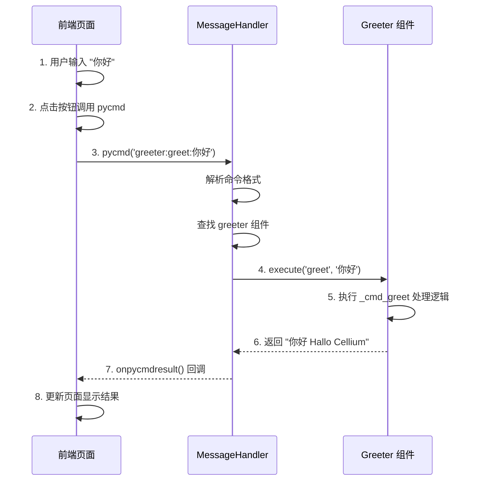

# Cellium 组件开发教程

[English](component-tutorial.en.md) | [返回主文档](../README.md) | [English Main](../README.en.md)

> **"在 Cellium 中，写一个功能模块就像写一个简单的 Python 函数一样自然，而剩下的复杂通信，交给微内核。"**

本教程通过一个完整的示例，演示如何从零开始创建 Cellium 组件。我们将构建一个「问候组件」，它接收前端输入的文字，在后面添加「Hallo Cellium」后缀，然后返回显示。

## 1. Cellium 通信协议

在开始编码之前，我们先理解 Cellium 的核心通信协议。所有的跨层通讯都遵循「细胞寻址协议」：

```
pycmd('cell:command:args')
```

| 组成部分 | 说明 | 示例 |
|----------|------|------|
| **Cell** | 目标细胞的名称（组件标识符） | `greeter` |
| **Command** | 细胞要执行的动作 | `greet` |
| **Args** | 传递给动作的参数（**整体作为单个字符串**） | `你好` |

**协议示例：**
```
# 向 greeter 组件发送 greet 命令，参数为 "你好"
pycmd('greeter:greet:你好')

# 向 calculator 组件发送 calc 命令，参数为完整表达式 "1+1"
pycmd('calculator:calc:1+1')

# 传递包含冒号的参数（如文件路径）
pycmd('filemanager:read:C:/test.txt')
```

> 💡 **Args 说明**: 参数部分整体作为单个字符串传入。如果需要传递多个参数，请在组件内部自行解析（例如用 `args.split(':')` 拆分）。

这种简洁的协议设计让前端与后端的通信变得直观而强大。

## 2. 创建组件文件

在 `app/components/` 目录下创建新文件 `greeter.py`：

```python
# app/components/greeter.py
# -*- coding: utf-8 -*-
"""
Greeter 组件示例

演示 Cellium 框架的基本用法：
1. 前端输入文字发送到后端
2. 后端处理并添加后缀
3. 前端更新显示结果
"""

from app.core.interface.icell import ICell


class Greeter(ICell):
    """问候组件：接收文字，添加后缀后返回"""

    @property
    def cell_name(self) -> str:
        """组件唯一标识，用于前端调用"""
        return "greeter"

    def execute(self, command: str, *args, **kwargs):
        """自动映射命令到以 _cmd_ 开头的方法"""
        method_name = f"_cmd_{command}"
        if hasattr(self, method_name):
            method = getattr(self, method_name)
            return method(*args, **kwargs)
        return f"Cell '{self.cell_name}' has no command: {command}"

    def get_commands(self) -> dict:
        """返回可用命令列表"""
        return {
            "greet": "添加问候后缀，例如: greeter:greet:你好"
        }

    def _cmd_greet(self, text: str = "") -> str:
        """添加 Hallo Cellium 后缀"""
        if not text:
            return "Hallo Cellium"
        return f"{text} Hallo Cellium"
```

## 2. 组件结构解析

每个 Cellium 组件必须继承 `ICell` 接口，并实现三个核心方法：

| 方法 | 说明 |
|------|------|
| `cell_name` | 组件唯一标识，小写字母，用于前端 `pycmd()` 调用 |
| `execute(command, *args)` | 执行具体命令，`command` 是命令名，`*args` 是参数 |
| `get_commands()` | 返回命令说明字典，供前端参考 |

执行流程：

```mermaid
flowchart LR
    A[前端 pycmd<br/>pycmd('greeter:greet:你好')] --> B[MessageHandler<br/>解析命令]
    B --> C[找到 greeter 组件]
    C --> D[调用 execute<br/>execute('greet', '你好')]
    D --> E[执行 _cmd_greet<br/>返回结果]
    E --> F["返回<br/>'你好 Hallo Cellium'"]
```

> 💡 **细胞生命周期提示**：虽然 Greeter 很简单，但由于它继承自 `ICell`，它已经自动获得了框架注入的 `self.logger` 和 `self.bus`。你可以在命令方法里直接使用：
> ```python
> def _cmd_greet(self, text: str = "") -> str:
>     self.logger.info(f"收到问候请求: {text}")
>     return f"{text} Hallo Cellium"
> ```

## 3. 注册组件

编辑 `config/settings.yaml`，将新组件添加到配置中：

```yaml
# config/settings.yaml
enabled_components:
  - app.components.calculator.Calculator
  - app.components.greeter.Greeter    # 添加这一行
```

重启应用后，组件会自动加载。启动日志会显示：

```
[INFO] 已加载组件: Greeter (cell_name: greeter)
```

## 4. 前端集成

在 HTML 中添加输入框和按钮，调用新组件：

```html
<!-- index.html -->
<!DOCTYPE html>
<html>
<head>
    <meta charset="UTF-8">
    <title>Cellium 组件演示</title>
    <style>
        body {
            font-family: Arial, sans-serif;
            padding: 20px;
        }
        .container {
            max-width: 600px;
            margin: 0 auto;
        }
        .input-group {
            margin: 15px 0;
        }
        input[type="text"] {
            padding: 10px;
            width: 300px;
            font-size: 16px;
        }
        button {
            padding: 10px 20px;
            font-size: 16px;
            cursor: pointer;
            background-color: #4CAF50;
            color: white;
            border: none;
            border-radius: 4px;
        }
        button:hover {
            background-color: #45a049;
        }
        #result {
            margin-top: 20px;
            padding: 15px;
            background-color: #f5f5f5;
            border-radius: 4px;
            font-size: 18px;
            min-height: 24px;
        }
    </style>
</head>
<body>
    <div class="container">
        <h1>Greeter 组件演示</h1>
        
        <div class="input-group">
            <input type="text" id="input-text" placeholder="输入你想说的话...">
            <button onclick="sendToGreeter()">发送问候</button>
        </div>
        
        <div id="result">结果将显示在这里...</div>
    </div>

    <script>
        function sendToGreeter() {
            var input = document.getElementById('input-text');
            var resultDiv = document.getElementById('result');
            var text = input.value.trim();
            
            if (!text) {
                resultDiv.textContent = '请输入文字！';
                return;
            }
            
            // 调用 Greeter 组件
            pycmd('greeter:greet:' + text);
        }
        
        // 监听来自后端的消息
        function onpycmdresult(result) {
            var resultDiv = document.getElementById('result');
            resultDiv.textContent = result;
        }
    </script>
</body>
</html>
```

## 5. 完整交互流程

以下是完整的交互时序图：



## 6. 运行效果

| 步骤 | 前端操作 | 后端处理 | 显示结果 |
|------|----------|----------|----------|
| 1 | 输入「你好」 | 接收参数 | — |
| 2 | 点击「发送问候」 | 添加后缀 | — |
| 3 | — | 返回「你好 Hallo Cellium」 | — |
| 4 | onpycmdresult 回调 | — | 「你好 Hallo Cellium」 |

## 7. 扩展功能

Greeter 组件还支持反转文字功能。只需添加新的 `_cmd_` 方法即可扩展功能，无需修改 `execute` 主逻辑：

```python
def execute(self, command: str, *args, **kwargs):
    """自动映射命令到以 _cmd_ 开头的方法"""
    method_name = f"_cmd_{command}"
    if hasattr(self, method_name):
        method = getattr(self, method_name)
        return method(*args, **kwargs)
    return f"Cell '{self.cell_name}' has no command: {command}"

def get_commands(self) -> dict:
    return {
        "greet": "添加问候后缀，例如: greeter:greet:你好",
        "reverse": "反转并添加问候后缀，例如: greeter:reverse:你好"
    }

def _cmd_greet(self, text: str = "") -> str:
    """添加 Hallo Cellium 后缀"""
    if not text:
        return "Hallo Cellium"
    return f"{text} Hallo Cellium"

def _cmd_reverse(self, text: str = "") -> str:
    """反转文字并添加问候后缀"""
    if not text:
        return "Hallo Cellium"
    reversed_text = text[::-1]
    return f"{reversed_text} Hallo Cellium"
```

前端调用方式：

```javascript
// 反转问候
pycmd('greeter:reverse:Cellium')
// 结果: "malloC Hallo Cellium"
```

## 8. 调试技巧

开发过程中，可以通过日志查看组件调用情况：

```python
import logging
logger = logging.getLogger(__name__)

class Greeter(ICell):
    def execute(self, command: str, *args, **kwargs):
        logger.info(f"[Greeter] 收到命令: {command}, 参数: {args}")
        # ... 处理逻辑
        logger.info(f"[Greeter] 返回结果: {result}")
        return result
```

启动日志输出示例：

```
[INFO] [Greeter] 收到命令: greet, 参数: ('你好',)
[INFO] [Greeter] 返回结果: 你好 Hallo Cellium
```

## 9. 常见问题

**问：组件加载失败怎么办？**

检查 `config/settings.yaml` 中的路径是否正确：

```yaml
enabled_components:
  - app.components.greeter.Greeter  # 必须是完整的模块路径
```

**问：前端调用显示「Unknown command」？**

确保命令名与 `execute` 方法中的判断一致：

```python
# 组件中
if command == "greet":  # 这里是 "greet"

# 前端调用
pycmd('greeter:greet:xxx')  # 也要用 "greet"
```

**问：如何传递多个参数？**

由于协议将 Args 整体作为单个字符串传入，如需多个参数，请在组件内部拆分：

```python
# 组件
def execute(self, command: str, *args, **kwargs):
    if command == "greet":
        full_args = args[0] if args else ""  # "Alice:Hello"
        parts = full_args.split(':')  # 自行拆分
        name = parts[0]  # "Alice"
        prefix = parts[1] if len(parts) > 1 else "Hello"  # "Hello"

# 前端
pycmd('greeter:greet:Alice:Hello')
```

## 10. 完整文件清单

本教程创建的文件：

| 文件 | 说明 |
|------|------|
| `app/components/greeter.py` | Greeter 组件实现 |
| `config/settings.yaml` | 组件配置文件（需修改） |
| `index.html` | 前端页面（需修改或新建） |

通过本教程，你已经掌握了 Cellium 组件开发的基本流程。类似的，你可以创建任意功能的组件，只需继承 `ICell` 接口并实现三个核心方法即可。
