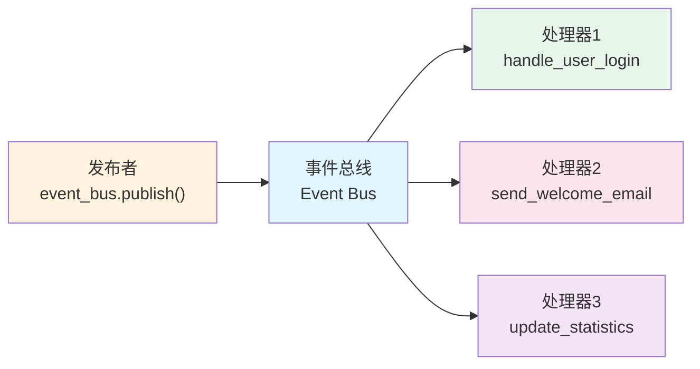

# 事件模式教程

[中文](index.md)|[English](index.en.md)

## 教程

- [Component Tutorial](component-tutorial.en.md) | [组件开发教程（中文）](component-tutorial.md)
- [Multiprocessing Tutorial](multiprocessing-tutorial.en.md) | [多进程教程（中文）](multiprocessing-tutorial.md)
- [Event Mode Tutorial](event-mode-tutorial.en.md) | [事件模式教程（中文）](event-mode-tutorial.md)
- [Logging Tutorial](logging-tutorial.en.md) | [日志使用（中文）](logging-tutorial.md)

> **"在 Cellium 中，事件是一种更自由的连接方式——你只需要专注于『发生了什么』，而事件的传播、路由和响应，都交给事件总线。"**

> 💡 **前置提示**：在开始学习事件模式之前，建议你先熟悉 [组件开发教程](component-tutorial.md)，了解 Cellium 的基本架构和命令模式。事件模式是命令模式的补充，两者结合使用可以让你的应用更加灵活和强大。

本教程将带你深入了解 Cellium 中的**事件模式**（Event Mode）。如果说命令模式是一对一的对讲机通信，那么事件模式就是广播电台——一个事件可以同时触发多个响应。想象一下：当你发布一条「用户登录成功」的消息时，消息日志系统可以记录它、统计数据可以更新它、邮件服务可以发送欢迎邮件——所有这些都可以同时发生，而你只需要发布一条事件！

## 1. 为什么需要事件模式？

在实际的软件开发中，你经常会遇到这样的场景：一个操作需要触发多个不同的响应。比如用户下单后，你需要更新库存、发送通知、记录日志、刷新界面……如果用命令模式，你需要逐个调用这些功能，不仅代码耦合度高，而且每次添加新功能都要修改原有代码。

事件模式就是为了解决这些问题而生的。它基于**发布-订阅**（Publish-Subscribe）模式，让发布者和订阅者之间不需要直接认识对方。就像你订阅了一个微信公众号，公众号更新时会自动推送消息给你，但你不需要知道公众号是怎么运作的，公众号也不需要知道有多少人订阅了它。

这种模式有几个显著的好处：

- **松耦合**：发布者和订阅者互不知道对方的存在，你可以随意添加或移除订阅者，而不需要修改发布者的代码。
- **多播支持**：一个事件可以被多个处理器同时订阅，一个动作触发多个响应变得轻而易举。
- **动态管理**：可以在运行时动态添加或移除事件订阅，灵活应对各种场景。
- **广播通信**：一个事件可以触发多个不同的响应动作，适合实现插件化架构。

> 💡 **什么时候用事件模式？** 当你需要「一个动作触发多个响应」时，优先考虑事件模式。比如用户注册后需要发送欢迎邮件、初始化用户数据、记录注册日志、刷新推荐内容等场景。

## 2. 快速入门：第一个事件

让我们从一个最简单的例子开始，感受一下事件模式的魅力。首先，你需要导入事件相关的 API：

```python
from app.core.bus import event_bus, event  # 导入事件总线和事件装饰器
```

### 2.1 订阅一个事件

使用 `@event()` 装饰器可以轻松订阅事件。就像给一个函数贴上标签，告诉系统「当这个事件发生时，请调用我」：

```python
from app.core.bus import event

@event("user.login")  # 订阅 user.login 事件
def handle_user_login(**kwargs):
    """用户登录事件处理器"""
    username = kwargs.get("username", "未知用户")  # 从事件数据中获取用户名
    print(f"用户 {username} 已成功登录！")
    print(f"登录时间：{kwargs.get('login_time', '未知')}")
```

> 💡 **小贴士**：事件处理器的参数使用 `**kwargs` 接收，这样你可以接收任意数量的命名参数，灵活应对各种事件数据。

### 2.2 发布一个事件

发布事件非常简单，只需要调用 `event_bus.publish()` 方法，并传入事件名称和要传递的数据：

```python
from app.core.bus import event_bus

# 触发用户登录事件，并传递相关数据
event_bus.publish(
    "user.login",
    username="张三",
    login_time="2024-01-15 10:30:00",
    ip_address="192.168.1.100"
)
```

**执行结果**：
```
用户 张三 已成功登录！
登录时间：2024-01-15 10:30:00
```

> 💡 **小贴士**：你可以传递任意类型的数据给事件，事件总线会将这些数据原封不动地传递给所有订阅者。

### 2.3 完整交互流程

下面是一个完整的交互流程图，帮助你理解事件的流动方向：



## 3. 深入探索：更多订阅方式

掌握了基础之后，让我们来看看事件模式提供的各种强大功能。

### 3.1 一次性事件：只执行一次的监听

有时候你只需要监听一次事件，事件触发后就不再需要该处理器了。比如应用启动时的初始化操作，只需要执行一次就够了。这时候可以使用 `@event_once()` 装饰器：

```python
from app.core.bus import event_once

@event_once("app.startup")  # 只执行一次的启动事件
def initialize_application(**kwargs):
    """应用启动初始化"""
    print("[初始化] 加载配置...")
    print("[初始化] 连接数据库...")
    print("[初始化] 启动后台任务...")
    print("[初始化] 应用准备就绪！")
```

> 💡 **使用场景**：一次性事件非常适合初始化操作、首次运行引导、一次性数据加载等场景。

你也可以手动订阅一次性事件：

```python
from app.core.bus import event_bus

def database_connected(**kwargs):
    """数据库连接成功后执行"""
    print(f"数据库连接成功！驱动：{kwargs.get('driver')}")

event_bus.subscribe_once("database.connected", database_connected)
```

### 3.2 模式匹配：一个订阅器监听一类事件

如果你想监听所有以「user.」开头的事件该怎么办？一个一个订阅太麻烦了。事件模式提供了强大的模式匹配功能，使用 `@event_pattern()` 装饰器：

```python
from app.core.bus import event_pattern

@event_pattern("user.*")  # 监听所有 user. 开头的 events
def handle_all_user_events(**kwargs):
    """处理所有用户相关事件"""
    event_name = kwargs.get("_event_name")  # 事件总线会自动传入事件名
    print(f"收到用户事件：{event_name}")
    
    # 根据不同事件做不同处理
    if event_name == "user.login":
        print("→ 用户登录了")
    elif event_name == "user.logout":
        print("→ 用户登出了")
    elif event_name == "user.register":
        print("→ 用户注册了")
```

模式匹配支持以下通配符：

| 通配符 | 含义 | 示例 |
|--------|------|------|
| `*` | 匹配单个词 | `user.*` 匹配 `user.login`、`user.logout` |
| `#` | 匹配多个词（零个或多个） | `order.#.created` 匹配 `order.created`、`order.item.created` |
| `?` | 匹配单个字符 | `user.?` 匹配 `user.a`、`user.1` |

> 💡 **模式匹配示例**：
> - `notification.*` 匹配 `notification.email`、`notification.sms`、`notification.push`
> - `order.#.created` 匹配 `order.created`、`order.item.created`、`order.package.item.created`
> - `data.?` 匹配 `data.1`、`data.a`、`data.x`

### 3.3 通配符订阅：监听所有事件

如果你想监听 absolutely 所有事件，可以使用 `@event_wildcard()` 装饰器。这在实现日志系统、调试工具或全局监控时非常有用：

```python
from app.core.bus import event_wildcard

@event_wildcard()  # 监听所有事件
def global_event_logger(**kwargs):
    """记录所有事件（用于调试和监控）"""
    event_name = kwargs.get("_event_name")
    # 过滤掉内部参数，只保留业务数据
    event_data = {k: v for k, v in kwargs.items() if not k.startswith("_")}
    print(f"[全局日志] {event_name}：{event_data}")
```

> 💡 **调试技巧**：在开发阶段添加一个通配符订阅器，可以帮助你了解整个应用的事件流，快速定位问题。

### 3.4 优先级控制：谁先谁后我说了算

当多个处理器订阅同一个事件时，你可能需要控制它们的执行顺序。事件模式提供了优先级机制，数字越大优先级越高：

```python
from app.core.bus import event, EventPriority

@event("data.saved", priority=EventPriority.HIGHEST)  # 最高优先级
def validate_data_first(**kwargs):
    """最先执行：数据验证"""
    print("[1] 验证数据有效性...")

@event("data.saved", priority=EventPriority.HIGH)
def process_data_second(**kwargs):
    """第二个执行：数据处理"""
    print("[2] 处理数据...")

@event("data.saved", priority=EventPriority.NORMAL)  # 默认优先级
def save_data_third(**kwargs):
    """第三个执行：保存数据"""
    print("[3] 保存数据到数据库...")

@event("data.saved", priority=EventPriority.LOW)
def log_data_last(**kwargs):
    """最后执行：记录日志"""
    print("[4] 记录操作日志...")
```

Cellium 预定义了五个优先级级别：

| 级别 | 常量 | 值 | 适用场景 |
|------|------|-----|----------|
| 最低 | `EventPriority.LOWEST` | 0 | 日志记录、监控 |
| 低 | `EventPriority.LOW` | 100 | 非关键后续处理 |
| 中 | `EventPriority.NORMAL` | 500 | 普通业务逻辑 |
| 高 | `EventPriority.HIGH` | 1000 | 核心业务处理 |
| 最高 | `EventPriority.HIGHEST` | 10000 | 验证、拦截 |

> 💡 **优先级建议**：遵循「验证先于处理、处理先于保存、保存先于日志」的原则，让数据流更加安全和可控。

## 4. 发布事件的多种方式

学会了订阅事件，让我们来看看如何发布事件。Cellium 提供了多种发布事件的方式，满足不同场景的需求。

### 4.1 直接发布：使用 event_bus.publish()

最直接的方式是通过 `event_bus.publish()` 方法发布事件，可以传递任意类型的数据：

```python
from app.core.bus import event_bus

# 发布简单事件
event_bus.publish("user.login", username="小明", role="管理员")

# 发布带复杂数据的事件
event_bus.publish(
    "order.created",
    order_id="ORD-2024-0001",
    customer_id="C001",
    items=[
        {"product_id": "P001", "name": "Python编程指南", "quantity": 1, "price": 89.00},
        {"product_id": "P002", "name": "Flask实战教程", "quantity": 2, "price": 128.00}
    ],
    total_amount=345.00,
    payment_method="微信支付",
    shipping_address="北京市海淀区xxx路xxx号"
)
```

### 4.2 自动发布：使用 @emitter 装饰器

如果你希望某个方法在执行时自动触发事件，可以使用 `@emitter()` 装饰器。这让你的业务代码更加简洁，不需要手动调用 `publish()`：

```python
from app.core.bus import emitter, event

class UserService:
    """用户服务组件"""
    
    def __init__(self):
        self.users = {}
    
    @emitter("user.registered")  # 方法执行后自动触发事件
    def register_user(self, username: str, email: str, password: str) -> bool:
        """注册新用户，成功时触发事件"""
        if username in self.users:
            print(f"用户名 {username} 已存在")
            return False
        
        self.users[username] = {
            "email": email,
            "registered_at": "2024-01-15",
            "status": "active"
        }
        print(f"用户 {username} 注册成功")
        return True
    
    @emitter("user.login")
    def login(self, username: str, password: str) -> bool:
        """用户登录，成功时触发事件"""
        if username not in self.users:
            print(f"用户不存在")
            return False
        
        print(f"用户 {username} 登录成功")
        return True

# 使用示例
user_service = UserService()

# 注册用户（会自动触发 user.registered 事件）
user_service.register_user("张三", "zhangsan@email.com", "password123")

# 登录（会自动触发 user.login 事件）
user_service.login("张三", "password123")
```

> 💡 **使用技巧**：使用 `@emitter` 装饰器时，方法的所有参数会自动传递给事件订阅者，你可以在订阅器中通过 `kwargs` 获取这些参数。

### 4.3 条件发布：只在满足条件时触发事件

有些场景下，你希望只在满足特定条件时才发布事件。这可以通过在代码中加入条件判断来实现：

```python
from app.core.bus import event, event_bus

@event("order.paid")
def handle_order_paid(**kwargs):
    """订单支付成功处理"""
    order_id = kwargs.get("order_id")
    print(f"[通知] 订单 {order_id} 支付成功，将发送确认邮件")

class PaymentService:
    """支付服务"""
    
    def process_payment(self, order_id: str, amount: float, payment_method: str):
        """处理支付"""
        # 模拟支付逻辑
        payment_success = True  # 这里是你的支付逻辑
        
        # 只在支付成功时发布事件
        if payment_success:
            event_bus.publish(
                "order.paid",
                order_id=order_id,
                amount=amount,
                payment_method=payment_method,
                paid_at="2024-01-15 10:30:00"
            )
            print(f"订单 {order_id} 支付成功，已发布事件")
        else:
            print(f"订单 {order_id} 支付失败")
```

## 5. 命名空间：防止事件名冲突的利器

当你的应用变得越来越复杂，可能会有多个模块都定义了自己的事件。如果不小心使用了相同的事件名，就会造成混乱。命名空间就是来解决这个问题的。

### 5.1 什么是命名空间？

命名空间就像给事件名加上一个前缀，把事件分类管理。比如「用户登录」事件，在用户模块中可以用 `user.login`，在订单模块中也可以用 `user.login`（虽然含义不同），但如果两个模块同时存在，就会产生冲突。

使用命名空间后，你可以这样区分：

| 事件名 | 含义 |
|--------|------|
| `user.login` | 用户模块的用户登录 |
| `notification.user.login` | 通知模块监听的用户登录 |
| `analytics.user.login` | 分析模块监听的用户登录 |

### 5.2 使用命名空间

使用 `set_event_namespace()` 函数可以设置全局命名空间前缀：

```python
from app.core.bus import event, set_event_namespace

# 设置命名空间
set_event_namespace("shop")

@event("order.created")  # 实际订阅的是 "shop.order.created"
def handle_order_created(**kwargs):
    order_id = kwargs.get("order_id")
    print(f"[商店] 订单 {order_id} 已创建")
```

发布事件时，命名空间前缀会自动添加：

```python
from app.core.bus import event_bus

event_bus.publish("order.created", order_id="ORD-001")  # 实际发布的是 "shop.order.created"
event_bus.publish("order.cancelled", order_id="ORD-001")  # 实际发布的是 "shop.order.cancelled"
```

> 💡 **命名空间建议**：为每个主要模块设置独立的命名空间，如 `user`、`order`、`notification`、`analytics` 等，让事件名更加清晰和有序。

### 5.3 命名空间实战

假设我们正在开发一个电商系统，不同模块使用不同的命名空间：

```python
from app.core.bus import event, event_bus, set_event_namespace

# ==================== 用户模块 ====================
set_event_namespace("user")

@event("login")
def user_login_handler(**kwargs):
    """用户模块：处理用户登录"""
    print(f"[用户模块] 用户 {kwargs.get('username')} 登录了")

@event("register")
def user_register_handler(**kwargs):
    """用户模块：处理用户注册"""
    print(f"[用户模块] 新用户注册：{kwargs.get('email')}")

# ==================== 订单模块 ====================
set_event_namespace("order")

@event("created")
def order_created_handler(**kwargs):
    """订单模块：处理订单创建"""
    print(f"[订单模块] 新订单：{kwargs.get('order_id')}")

@event("paid")
def order_paid_handler(**kwargs):
    """订单模块：处理订单支付"""
    print(f"[订单模块] 订单已支付：{kwargs.get('order_id')}")
```

发布事件时：

```python
# 用户模块的事件
event_bus.publish("user.login", username="张三")
event_bus.publish("user.register", email="zhangsan@email.com")

# 订单模块的事件
event_bus.publish("order.created", order_id="ORD-001")
event_bus.publish("order.paid", order_id="ORD-001")
```

**执行结果**：
```
[用户模块] 用户 张三 登录了
[用户模块] 新用户注册：zhangsan@email.com
[订单模块] 新订单：ORD-001
[订单模块] 订单已支付：ORD-001
```

## 6. 模式对比：命令模式 vs 事件模式

你可能会问：命令模式和事件模式有什么区别？我应该在什么时候使用哪种模式？让我们来做一个详细的对比：

| 特性 | 命令模式 | 事件模式 |
|------|---------|---------|
| **通信方式** | 前端 → 后端组件（一对一） | 前端 → EventBus → 多个订阅者（一对多） |
| **返回值** | 有（同步响应） | 无（异步通知） |
| **耦合度** | 较高（调用者知道被调用者） | 低（发布者和订阅者互不知情） |
| **灵活性** | 添加新功能需要修改调用方 | 添加新功能只需添加新订阅者 |
| **适用场景** | 请求-响应、需要返回值的场景 | 解耦通知、一个动作触发多个响应 |

> 💡 **如何选择？**
> - 需要用户点击按钮后获取结果 → 用命令模式
> - 用户操作后需要同时更新多个界面 → 用事件模式
> - 组件之间需要通信但不应该直接引用 → 用事件模式
> - 简单的 CRUD 操作 → 用命令模式

## 7. 实战演练：完整的电商事件系统

让我们通过一个完整的示例，将前面学到的所有知识综合运用起来。这个示例模拟了一个电商系统中的事件流程：

```python
from app.core.bus import (
    event, event_once, event_pattern, event_wildcard,
    emitter, event_bus, EventPriority
)

# ==================== 1. 定义事件订阅器 ====================

# 高优先级的验证处理器
@event("order.create", priority=EventPriority.HIGHEST)
def validate_order(**kwargs):
    """验证订单数据（最先执行）"""
    order_id = kwargs.get("order_id")
    items = kwargs.get("items", [])
    print(f"[验证] 检查订单 {order_id} 的数据...")
    if not items:
        print("[验证] 订单没有商品，验证失败")
        return False
    print("[验证] 订单数据验证通过")
    return True

# 普通优先级的订单处理器
@event("order.create", priority=EventPriority.NORMAL)
def create_order_record(**kwargs):
    """创建订单记录"""
    order_id = kwargs.get("order_id")
    customer = kwargs.get("customer")
    print(f"[订单] 创建订单记录：{order_id}，客户：{customer}")

# 库存处理器
@event("order.create")
def reserve_inventory(**kwargs):
    """预留库存"""
    order_id = kwargs.get("order_id")
    items = kwargs.get("items", [])
    print(f"[库存] 为订单 {order_id} 预留库存：")
    for item in items:
        print(f"       - {item['name']} x {item['quantity']}")

# 低优先级的日志处理器
@event("order.create", priority=EventPriority.LOW)
def log_order_creation(**kwargs):
    """记录订单创建日志"""
    order_id = kwargs.get("order_id")
    print(f"[日志] 订单 {order_id} 创建完成")

# 一次性事件：应用首次启动
@event_once("app.first_start")
def first_start_initialization(**kwargs):
    """应用首次启动初始化"""
    print("[初始化] 首次启动，执行初始化配置...")
    print("[初始化] 加载默认分类...")
    print("[初始化] 设置默认参数...")

# 模式匹配：监听所有订单相关事件
@event_pattern("order.*")
def handle_all_order_events(**kwargs):
    """处理所有订单事件"""
    event_name = kwargs.get("_event_name")
    print(f"[监控] 捕获订单事件：{event_name}")

# 通配符：监听所有事件用于统计
@event_wildcard(priority=EventPriority.LOWEST)
def event_statistics(**kwargs):
    """事件统计（最低优先级，最后执行）"""
    event_name = kwargs.get("_event_name")
    print(f"[统计] 事件计数器：{event_name}")


# ==================== 2. 定义事件发布类 ====================

class OrderService:
    """订单服务组件"""
    
    def __init__(self):
        self.order_counter = 0
    
    @emitter("order.create")
    def create_order(self, customer: str, items: list):
        """创建新订单"""
        self.order_counter += 1
        order_id = f"ORD-{self.order_counter:04d}"
        
        print(f"\n>>> 正在创建订单 {order_id}...")
        
        return {
            "order_id": order_id,
            "customer": customer,
            "items": items
        }


# ==================== 3. 执行演示 ====================

if __name__ == "__main__":
    print("=" * 60)
    print("电商事件系统演示")
    print("=" * 60)
    
    # 触发一次性事件
    print("\n【步骤1】应用首次启动")
    event_bus.publish("app.first_start")
    
    # 创建订单服务
    order_service = OrderService()
    
    # 创建订单（会触发 order.create 事件）
    print("\n【步骤2】创建第一个订单")
    order_service.create_order(
        customer="张三",
        items=[
            {"name": "Python编程指南", "quantity": 1, "price": 89.00},
            {"name": "Flask实战教程", "quantity": 2, "price": 128.00}
        ]
    )
    
    print("\n【步骤3】创建第二个订单")
    order_service.create_order(
        customer="李四",
        items=[
            {"name": "Django企业开发实战", "quantity": 1, "price": 159.00}
        ]
    )
    
    print("\n" + "=" * 60)
    print("演示结束")
    print("=" * 60)
```

**执行结果**：
```
============================================================
电商事件系统演示
============================================================

【步骤1】应用首次启动
[初始化] 首次启动，执行初始化配置...
[初始化] 加载默认分类...
[初始化] 设置默认参数...

【步骤2】创建第一个订单

>>> 正在创建订单 ORD-0001...
[验证] 检查订单 ORD-0001 的数据...
[验证] 订单数据验证通过
[订单] 创建订单记录：ORD-0001，客户：张三
[库存] 为订单 ORD-0001 预留库存：
       - Python编程指南 x 1
       - Flask实战教程 x 2
[日志] 订单 ORD-0001 创建完成
[监控] 捕获订单事件：order.create
[统计] 事件计数器：order.create

【步骤3】创建第二个订单

>>> 正在创建订单 ORD-0002...
[验证] 检查订单 ORD-0002 的数据...
[验证] 订单数据验证通过
[订单] 创建订单记录：ORD-0002，客户：李四
[库存] 为订单 ORD-0002 预留库存：
       - Django企业开发实战 x 1
[日志] 订单 ORD-0002 创建完成
[监控] 捕获订单事件：order.create
[统计] 事件计数器：order.create

============================================================
演示结束
============================================================
```

> 💡 **观察执行顺序**：你可以看到处理器按照优先级从高到低执行：高优先级的验证最先执行，低优先级的日志最后执行。这就是优先级控制的作用。

## 8. 前端如何发布事件

除了后端组件可以发布事件，前端也可以通过 `window.mbQuery()` 接口直接向事件总线发送事件。这是实现前后端解耦通信的重要方式。

### 8.1 使用 window.mbQuery 发布事件

事件总线的命令格式为 `bus:publish:事件名:JSON数据`：

```javascript
// 发布用户登录事件
window.mbQuery(0, 'bus:publish:user.login:{"username":"张三","role":"管理员"}', function(){});

// 发布订单创建事件
window.mbQuery(0, 'bus:publish:order.created:{"order_id":"ORD-001","items":[{"name":"商品A","quantity":1}]}', function(){});
```

### 8.2 前端事件发布示例

```html
<!DOCTYPE html>
<html>
<head>
    <meta charset="UTF-8">
    <title>事件模式前端示例</title>
    <style>
        body { font-family: Arial, sans-serif; padding: 20px; }
        .event-log { 
            margin-top: 20px;
            padding: 15px;
            background-color: #f5f5f5;
            border-radius: 4px;
            max-height: 300px;
            overflow-y: auto;
        }
        .log-item {
            padding: 8px;
            margin: 5px 0;
            background-color: white;
            border-radius: 4px;
            border-left: 4px solid #4CAF50;
        }
        button {
            padding: 10px 20px;
            margin: 5px;
            cursor: pointer;
        }
    </style>
</head>
<body>
    <h1>前端事件发布示例</h1>
    
    <div>
        <button onclick="publishUserLogin()">发布用户登录事件</button>
        <button onclick="publishOrderCreated()">发布订单创建事件</button>
        <button onclick="publishCustomEvent()">发布自定义事件</button>
    </div>
    
    <div class="event-log" id="eventLog">
        <div style="color: #666;">事件日志将显示在这里...</div>
    </div>
    
    <script>
        function logEvent(message) {
            var logDiv = document.getElementById('eventLog');
            var time = new Date().toLocaleTimeString();
            var logItem = document.createElement('div');
            logItem.className = 'log-item';
            logItem.innerHTML = `<strong>[${time}]</strong> ${message}`;
            logDiv.insertBefore(logItem, logDiv.firstChild);
        }
        
        function publishUserLogin() {
            var username = prompt("请输入用户名：", "张三");
            if (username) {
                window.mbQuery(0, 'bus:publish:user.login:{"username":"' + username + '","login_time":"' + new Date().toLocaleString() + '"}', function(){});
                logEvent(`发布 user.login 事件，用户：${username}`);
            }
        }
        
        function publishOrderCreated() {
            var orderData = JSON.stringify({
                order_id: "ORD-" + Date.now().toString().slice(-6),
                customer: "王五",
                items: [
                    {name: "商品A", quantity: 1, price: 99.00},
                    {name: "商品B", quantity: 2, price: 49.00}
                ],
                total_amount: 197.00
            });
            window.mbQuery(0, 'bus:publish:order.created:' + orderData, function(){});
            logEvent(`发布 order.created 事件，订单数据已发送`);
        }
        
        function publishCustomEvent() {
            var eventName = prompt("请输入事件名：", "my.custom.event");
            var eventData = prompt("请输入事件数据（JSON格式）：", '{"message":"Hello Event"}');
            if (eventName && eventData) {
                window.mbQuery(0, 'bus:publish:' + eventName + ':' + eventData, function(){});
                logEvent(`发布自定义事件：${eventName}`);
            }
        }
    </script>
</body>
</html>
```

## 9. 常见问题

**问：事件处理器接收不到数据怎么办？**

首先检查事件名是否完全一致（包括大小写）。然后确认 `publish` 时传递的参数名与 `kwargs.get()` 中使用的参数名一致。如果使用 `@event_pattern` 或 `@event_wildcard`，别忘了通过 `kwargs.get("_event_name")` 获取事件名。

**问：事件触发了但处理器没有执行？**

可能的原因有：处理器还没有注册就被触发了（确保先注册处理器再发布事件）、一次性事件已经被触发过了（一次性事件只能触发一次）、处理器在注册后发生了异常（检查日志输出）。

**问：如何取消订阅事件？**

使用 `event_bus.unsubscribe()` 方法取消订阅：

```python
from app.core.bus import event_bus

def temporary_handler(**kwargs):
    print("这是一个临时处理器")

# 订阅事件
event_bus.subscribe("temp.event", temporary_handler)

# ... 执行一些操作 ...

# 取消订阅
event_bus.unsubscribe("temp.event", temporary_handler)
```

**问：事件名冲突怎么办？**

使用命名空间来区分不同模块的事件。调用 `set_event_namespace("module_name")` 设置模块命名空间，所有该模块下的事件都会自动添加前缀。

**问：可以在事件处理器中发布新事件吗？**

完全可以！事件处理器中可以发布任意事件，这正是事件模式的强大之处。多个处理器可以形成事件链，一个事件触发另一个事件。

**问：事件处理有性能问题吗？**

Cellium 的事件总线经过优化，对于大多数场景性能是完全足够的。如果你的应用有极高的性能要求，建议：避免在事件处理中进行耗时操作、使用异步处理器处理耗时任务、合理设置优先级让重要事件优先处理。

## 10. 学习路径建议

掌握了事件模式后，你可以继续深入学习以下内容：

- **异步事件处理**：学习如何使用异步事件处理器，提高应用性能
- **事件分类管理**：学习如何组织大量的事件处理器，保持代码整洁
- **事件测试**：学习如何为事件系统编写单元测试，确保代码质量

> 💡 **总结**：事件模式是 Cellium 中非常强大的功能，它让你的应用各部分可以松耦合地通信。一个好的事件系统可以让你的代码更加清晰、灵活和可维护。希望这篇教程能帮助你很好地理解和使用事件模式。祝你开发愉快！

## 11. 完整文件清单

本教程涉及的文件：

| 文件路径 | 说明 |
|----------|------|
| `app/core/bus/event_bus.py` | 事件总线核心实现 |
| `app/core/bus/__init__.py` | 事件模块导出 |
| `docs/event-mode-tutorial.md` | 事件模式教程（本文档） |
| `docs/event-mode-tutorial.en.md` | 事件模式教程（英文版） |
| `docs/component-tutorial.md` | 组件开发教程（建议配合学习） |

---

<script type="module">
  import mermaid from 'https://cdn.jsdelivr.net/npm/mermaid@10/dist/mermaid.esm.min.mjs';
  mermaid.initialize({ startOnLoad: true });
</script>
