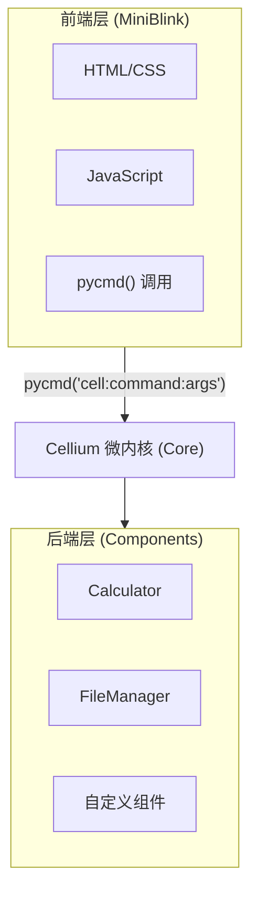
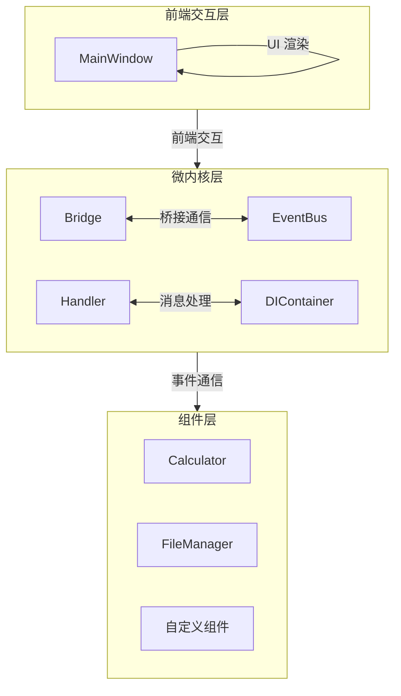
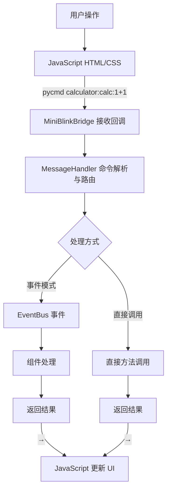
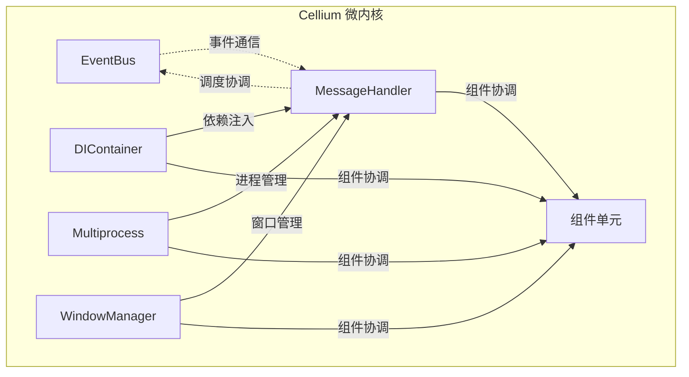

# Cellium

[中文](index.zh.md)

## 教程

- [组件开发教程](component-tutorial.en.md) | [组件开发教程（中文）](component-tutorial.md)
- [多进程教程](multiprocessing-tutorial.en.md) | [多进程教程（中文）](multiprocessing-tutorial.md)

---

**Python + HTML/JS 的桌面应用框架。**

基于"核心驱动-模块解耦"理念的 Python 桌面应用框架。

通过一个精密的微内核（Core）作为调度中枢，实现了前端交互与后端逻辑的彻底分离。开发者只需将功能封装为独立的"细胞单元"，其余的跨模块通信、并发调度与资源管理均由 Cellium 核心透明完成，让复杂的系统构建变得像拼图一样简单。

| 特点 | 说明 |
|------|------|
| **核心驱动** | 微内核统一调度，开发者只需关注业务逻辑 |
| **模块解耦** | 前后端独立开发，通过协议通信 |
| **简单** | 只需写 Python 函数定义功能，前端调用即可 |
| **灵活** | 完整 Web 前端生态，任意 UI 框架 |
| **轻量** | 基于 MiniBlink，体积小、启动快 |

**对比传统方案：**

| 方案 | 学习成本 | 开发效率 | UI 灵活性 |
|------|---------|---------|----------|
| PyQt/Tkinter | 高 | 中 | 低 |
| Electron | 中 | 高 | 高 |
| **Cellium** | **低** | **高** | **高** |

**快速示例：**
```python
# app/components/greeter.py
class Greeter(ICell):
    def _cmd_greet(self, text: str = "") -> str:
        return f"{text} Hallo Cellium"
```

```html
<!-- html/index.html -->
<button onclick="pycmd('greeter:greet:你好')">问候</button>
```

选择 Cellium：**用你熟悉的 Python 和 Web 技术，快速构建桌面应用。**

## MiniBlink 依赖

Cellium 依赖 [MiniBlink](https://github.com/weolar/miniblink49) 作为 WebView 引擎。

**下载地址：**

- **官方 GitHub Releases**: https://github.com/weolar/miniblink49/releases
- **每日构建版本**: https://gitcode.com/Resource-Bundle-Collection/68b02

**放置方法：**

1. 从上述地址下载 MiniBlink SDK（或直接下载 `mb132_x64.dll`）
2. 将 `mb132_x64.dll` 复制到项目根目录的 `dll/` 文件夹中：

```
python-miniblink/
├── dll/
│   └── mb132_x64.dll    # <-- 将下载的 DLL 放在这里
└── main.py
```

> **感谢**：感谢 [MiniBlink](https://github.com/weolar/miniblink49) 团队开源如此轻量级、高性能的浏览器引擎，让开发者能够轻松构建桌面应用。

## 核心理念

Cellium 的设计遵循"核心驱动-模块解耦"的核心哲学，将复杂系统简化为可组合的细胞单元。

### 核心驱动

微内核作为系统的唯一核心，负责：

- **命令路由** - 解析并分发前端命令到对应组件
- **事件调度** - 管理组件间的事件通信
- **生命周期** - 协调组件的加载、初始化和销毁
- **资源管理** - 统一管理多进程、线程等系统资源

### 模块解耦

每个组件单元（Cell）具有以下特性：

- **独立封装** - 组件包含完整的业务逻辑和状态
- **接口契约** - 所有组件实现统一的 ICell 接口
- **透明通信** - 通过事件总线进行跨组件通信
- **即插即用** - 配置即加载，无须修改核心代码

### 前端后端分离



## 架构设计



### 设计原则

1. **微内核架构** - 核心只负责调度和协调，不包含业务逻辑
2. **组件单元** - 所有功能以独立组件形式存在
3. **统一接口** - 所有组件实现 ICell 接口，遵循相同契约
4. **事件驱动** - 组件间通过事件总线通信，互不直接依赖
5. **依赖注入** - 组件无需手动导入核心服务，自动注入解耦

### 数据流向



## 目录结构

```
cellium/
├── app/
│   ├── core/                    # 微内核模块
│   │   ├── __init__.py          # 模块导出
│   │   ├── bus/                 # 事件总线
│   │   │   ├── __init__.py
│   │   │   └── event_bus.py     # 事件总线实现
│   │   ├── window/              # 窗口管理
│   │   │   ├── __init__.py
│   │   │   └── main_window.py   # 主窗口
│   │   ├── bridge/              # 桥接层
│   │   │   ├── __init__.py
│   │   │   └── miniblink_bridge.py  # MiniBlink 通信桥接
│   │   ├── handler/             # 消息处理
│   │   │   ├── __init__.py
│   │   │   └── message_handler.py   # 消息处理器（命令路由）
│   │   ├── util/                # 工具模块
│   │   │   ├── __init__.py
│   │   │   ├── logger.py        # 日志管理
│   │   │   ├── mp_manager.py    # 多进程管理器
│   │   │   └── components_loader.py  # 组件加载器
│   │   ├── di/                  # 依赖注入
│   │   │   ├── __init__.py
│   │   │   └── container.py     # DI 容器
│   │   ├── interface/           # 接口定义
│   │   │   ├── __init__.py
│   │   │   └── icell.py         # ICell 组件接口
│   │   ├── events.py            # 事件类型定义
│   │   └── event_models.py      # 事件模型定义
│   ├── components/                   # 组件单元
│   │   ├── __init__.py
│   │   └── calculator.py        # 计算器组件
│   └── __init__.py              # 应用入口
├── html/                        # HTML 资源
│   └── index.html               # 主页面
├── font/                        # 字体文件
├── dll/                         # DLL 文件
│   └── mb132_x64.dll            # MiniBlink 引擎
├── app_icon.ico                 # 应用图标
├── config/                      # 配置文件
│   └── settings.yaml            # 组件配置
├── dist/                        # 构建输出目录
├── main.py                      # 入口文件
├── build.bat                    # 构建脚本
├── requirements.txt             # 依赖配置
└── README.md                    # 文档
```

## 核心模块

### 微内核 Core

微内核是 Cellium 的核心调度器，负责协调各组件工作。



### 事件总线 EventBus

事件总线实现组件间的解耦通信，采用发布-订阅模式。

```python
from app.core import event_bus
from app.core.events import EventType

# 订阅事件
event_bus.subscribe(EventType.CALC_RESULT, on_calc_result)

# 发布事件
event_bus.publish(EventType.CALC_RESULT, result="2")
```

### 组件接口 ICell

所有组件必须实现的统一接口规范。

```python
from app.core.interface.icell import ICell

class MyCell(ICell):
    @property
    def cell_name(self) -> str:
        """组件名称，用于前端调用标识"""
        return "mycell"
    
    def execute(self, command: str, *args, **kwargs) -> any:
        """执行命令"""
        if command == "greet":
            return f"Hello, {args[0] if args else 'World'}!"
        return f"Unknown command: {command}"
    
    def get_commands(self) -> dict:
        """获取可用命令列表"""
        return {
            "greet": "打招呼，例如: mycell:greet:Alice"
        }
```

### 消息处理器 MessageHandler

消息处理器是前端与后端组件的桥梁，负责解析和路由命令。

```python
class MessageHandler:
    def handle_message(self, message: str) -> str:
        """处理前端消息
        
        支持两种格式：
        1. ICell 命令: 'cell_name:command:args'
        2. 事件消息: JSON 格式的事件数据
        """
        if ':' in message:
            # ICell 命令格式
            return self._handle_cell_command(message)
        else:
            # 事件消息格式
            return self._handle_event_message(message)
```

### 桥接层 MiniBlinkBridge

桥接层封装 Python 与 MiniBlink 浏览器引擎之间的通信，组件可通过 bridge 与前端页面交互。

### 依赖注入 DI

依赖注入容器提供自动化的服务注入。

```python
from app.core.di.container import injected, AutoInjectMeta

class Calculator(metaclass=AutoInjectMeta):
    mp_manager = injected(MultiprocessManager)
    event_bus = injected(EventBus)
    
    def calculate(self, expression: str) -> str:
        return self.mp_manager.submit(_calculate_impl, expression)

---

<script src="https://cdn.jsdelivr.net/npm/mermaid/dist/mermaid.min.js"></script>
<script>
  mermaid.initialize({startOnLoad: true, theme: 'default'});
</script>
