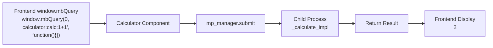
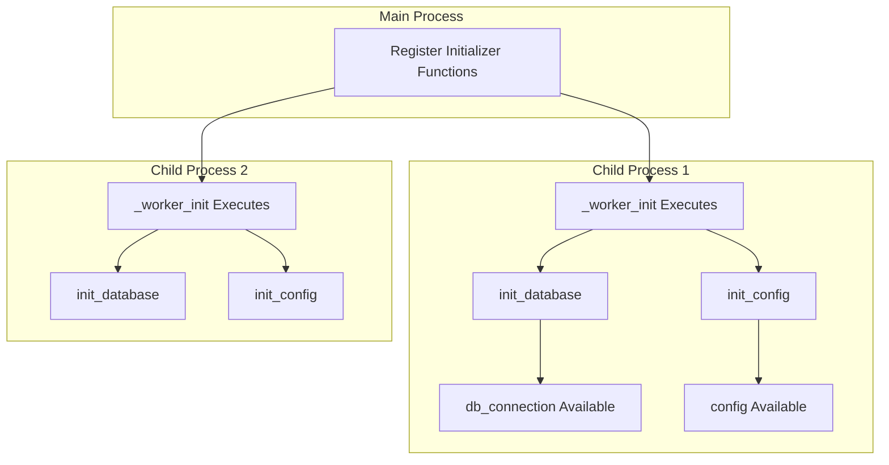

# Cellium Multiprocessing Tutorial

[中文](index.md)|[English](index.en.md)

## Tutorials

- [Component Tutorial](component-tutorial.en.md) | [组件开发教程](component-tutorial.md)
- [Multiprocessing Tutorial](multiprocessing-tutorial.en.md) | [多进程教程](multiprocessing-tutorial.md)
- [Event Mode Tutorial](event-mode-tutorial.en.md) | [事件模式教程](event-mode-tutorial.md)
- [Logging Tutorial](logging-tutorial.en.md) | [日志使用](logging-tutorial.md)

> **"Your CPU has multiple cores, why use only one? Let time-consuming tasks run in the background without blocking the UI."**

This tutorial introduces Cellium's multiprocessing feature, enabling your components to leverage multi-core CPUs.

## 1. Why Use Multiprocessing?

| Scenario | Single Process | Multiprocessing |
|----------|----------------|-----------------|
| Heavy Computation | UI freezes | UI stays responsive |
| Time-consuming Tasks | Wait to complete | Execute in parallel |
| CPU Utilization | 100% one core | 100% all cores |

```python
# Regular function - executes in main process, UI will freeze
def calculate_fibonacci(n):
    if n <= 1:
        return n
    return calculate_fibonacci(n-1) + calculate_fibonacci(n-2)

# Multiprocessed function - executes in background, UI stays responsive
@run_in_process
def calculate_fibonacci(n):
    if n <= 1:
        return n
    return calculate_fibonacci(n-1) + calculate_fibonacci(n-2)
```

## 2. Simplest Usage: @run_in_process Decorator

Add the `@run_in_process` decorator to a function, and it will execute in a child process.

### Example: Time-consuming Computation Without UI Freeze

```python
from app.core.util.mp_manager import run_in_process

# Regular function (executes in main process)
def fibonacci(n):
    if n <= 1:
        return n
    return fibonacci(n-1) + fibonacci(n-2)

# Decorated (executes in child process)
@run_in_process
def fibonacci_async(n):
    if n <= 1:
        return n
    return fibonacci_async(n-1) + fibonacci_async(n-2)

# Same calling convention
result = fibonacci_async(35)  # Won't freeze the UI!
print(result)
```

### Effect Comparison

| Operation | Regular Function | @run_in_process |
|-----------|------------------|-----------------|
| Calling | `fibonacci(35)` | `fibonacci_async(35)` |
| Execution Location | Main Process | Child Process |
| UI State | Freezes | Responsive |

## 3. Async Version: @run_in_process_async

Use `@run_in_process_async` when you need to use it in an async function:

```python
import asyncio
from app.core.util.mp_manager import run_in_process_async

@run_in_process_async
def heavy_computation(data: str) -> str:
    # Time-consuming processing
    result = data * 1000000
    return f"Processed: {len(result)} characters"

async def main():
    # Call in async function
    result = await heavy_computation("hello")
    print(result)

# Run async task
asyncio.run(main())
```

## 4. Direct Manager Usage

When you need more control, get `MultiprocessManager` directly:

```python
from app.core.util.mp_manager import get_multiprocess_manager

manager = get_multiprocess_manager()

# Synchronous execution
result = manager.submit(heavy_task, "arg1")

# Asynchronous execution (returns Future)
future = manager.submit_async(heavy_task, "arg1")
result = future.result()

# Batch execution
results = manager.map(task_function, [arg1, arg2, arg3, arg4])
```

### Manager API Quick Reference

| Method | Description | Example |
|--------|-------------|---------|
| `submit(func, *args)` | Synchronous execution, returns result | `manager.submit(calc, 100)` |
| `submit_async(func, *args)` | Asynchronous execution, returns Future | `future = manager.submit_async(calc, 100)` |
| `map(func, args_list)` | Execute multiple tasks in parallel | `results = manager.map(calc, [1,2,3])` |
| `shutdown()` | Shutdown the process pool | `manager.shutdown()` |

## 5. Using Multiprocessing in Components

The Calculator component already uses multiprocessing:

```python
from app.core.util.mp_manager import run_in_process
from app.core.interface.icell import ICell

def _calculate_impl(expression: str) -> str:
    """Pure function: calculate expression (executes in child process)"""
    sanitized = ''.join(c for c in expression if c in '0123456789+-*/.() ')
    result = eval(sanitized)
    return str(result)

class Calculator(ICell):
    mp_manager = injected(MultiprocessManager)
    
    def calculate(self, expression: str) -> str:
        """Calculate expression (automatically executes in child process)"""
        return self.mp_manager.submit(_calculate_impl, expression)
```

### Execution Flow



## 6. Child Process Initialization: @worker_initializer

Child processes are independent and cannot directly access main process variables. Use `@worker_initializer` to initialize resources in child processes:

```python
from app.core.util.mp_manager import worker_initializer, run_in_process

# Global variables (initialized in child process)
db_connection = None
config = None

@worker_initializer
def init_database():
    """Execute in each child process: initialize database"""
    global db_connection
    db_connection = "connected_database"
    print(f"Database connection created: {db_connection}")

@worker_initializer
def init_config():
    """Execute in each child process: load config"""
    global config
    config = {"api_key": "xxx", "timeout": 30}
    print(f"Config loaded: {config}")

@run_in_process
def query_data(sql: str) -> str:
    """Query data (can use global variables in child process)"""
    global db_connection, config
    # ✅ Can access
    return f"Using {db_connection} to execute: {sql}"
```

### Initialization Flow



## 7. Important Notes

### 7.1 Functions Must Be Serializable

Functions and arguments passed to child processes must be serializable by pickle:

```python
# ❌ Wrong: Closures cannot be serialized
def create_adder(x):
    def adder(y):
        return x + y
    return adder

# ✅ Correct: Use regular functions
def add(a, b):
    return a + b

# ✅ Correct: Use lambda
add = lambda a, b: a + b
```

### 7.2 Cannot Share Objects Across Processes

```python
# ❌ Wrong: Cannot share the same list
shared_list = []

@run_in_process
def modify_list():
    shared_list.append(1)  # Child process can't see this list

# ✅ Correct: Pass through arguments
@run_in_process
def modify_list(data):
    data.append(1)
    return data
```

### 7.3 Global Variables Are Independent

```python
# Main process
my_var = "main_process_value"

# Child process
@run_in_process
def check_var():
    # Child process has its own copy of my_var
    # If not initialized, may not be "main_process_value"
    print(my_var)
```

## 8. Complete Example

Complete example file: `app/examples/multiprocessing_initializer_example.py`

```python
# -*- coding: utf-8 -*-
"""
Multiprocessing Initializer Example
"""

import logging
from app.core.util.mp_manager import worker_initializer, run_in_process, get_multiprocess_manager

logging.basicConfig(level=logging.INFO, format='[%(levelname)s] %(message)s')
logger = logging.getLogger(__name__)

# Global variables (initialized in child process)
db_connection = None
config = None

@worker_initializer
def init_database():
    global db_connection
    logger.info("[Example] Initializing database connection...")
    db_connection = "mock_db_connection"
    logger.info(f"[Example] Database connection created: {db_connection}")

@worker_initializer
def init_config():
    global config
    logger.info("[Example] Loading configuration...")
    config = {"api_key": "secret", "timeout": 30}
    logger.info(f"[Example] Configuration loaded: {config}")

@run_in_process
def process_data(data: str) -> str:
    """Process data (use global variables in child process)"""
    global db_connection, config
    logger.info(f"[Child] Processing data: {data}")
    logger.info(f"[Child] Database connection: {db_connection}")
    logger.info(f"[Child] Config: {config}")
    return f"processed_{data}"

if __name__ == "__main__":
    logger.info("[Main] Starting...")
    result = process_data("test_data")
    logger.info(f"[Main] Result: {result}")
```

Running the example:

```
[主进程] 启动...
[示例] 正在初始化数据库连接...
[示例] 数据库连接已创建: mock_db_connection
[示例] 正在加载配置...
[示例] 配置已加载: {'api_key': 'secret', 'timeout': 30}
[子进程] 处理数据: test_data
[子进程] 数据库连接: mock_db_connection
[子进程] 配置: {'api_key': 'secret', 'timeout': 30}
[主进程] 结果: processed_test_data
```

## 9. FAQ

**Q: When does multiprocessing start automatically?**

It starts automatically on first call that needs a process (lazy loading). You can manually get it via `get_multiprocessManager().executor`.

**Q: How to disable multiprocessing?**

```python
manager = get_multiprocess_manager()
manager.set_enabled(False)  # All tasks will execute in main process
```

**Q: How many processes?**

Default is `multiprocessing.cpu_count()`. You can specify `max_workers` when creating `ProcessPoolExecutor`.

**Q: What happens on program exit?**

`atexit` automatically calls `shutdown()` to close the process pool, ensuring resource cleanup.

**Q: What if child process fails?**

Exceptions are passed back to the main process through pickle. Check logs for detailed error messages.

## 10. Summary

| Scenario | Recommended Usage |
|----------|-------------------|
| Simple time-consuming computation | `@run_in_process` |
| Call in async function | `@run_in_process_async` |
| Need more control | Use `MultiprocessManager` directly |
| Need to initialize resources | `@worker_initializer` |

Multiprocessing lets time-consuming tasks run in the background for a smoother user experience!

<script type="module">
  import mermaid from 'https://cdn.jsdelivr.net/npm/mermaid@10/dist/mermaid.esm.min.mjs';
  // 初始化，并将所有 class 为 language-mermaid 的 pre 标签渲染为图表
  mermaid.initialize({ startOnLoad: true });
  
  // 针对 Jekyll 的兼容处理：Jekyll 默认生成的代码块 class 是 language-mermaid
  window.addEventListener('load', () => {
    const codeBlocks = document.querySelectorAll('pre code.language-mermaid');
    codeBlocks.forEach(codeBlock => {
      const pre = codeBlock.parentElement;
      pre.classList.add('mermaid');
      pre.textContent = codeBlock.textContent;
    });
  });
</script>