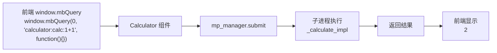
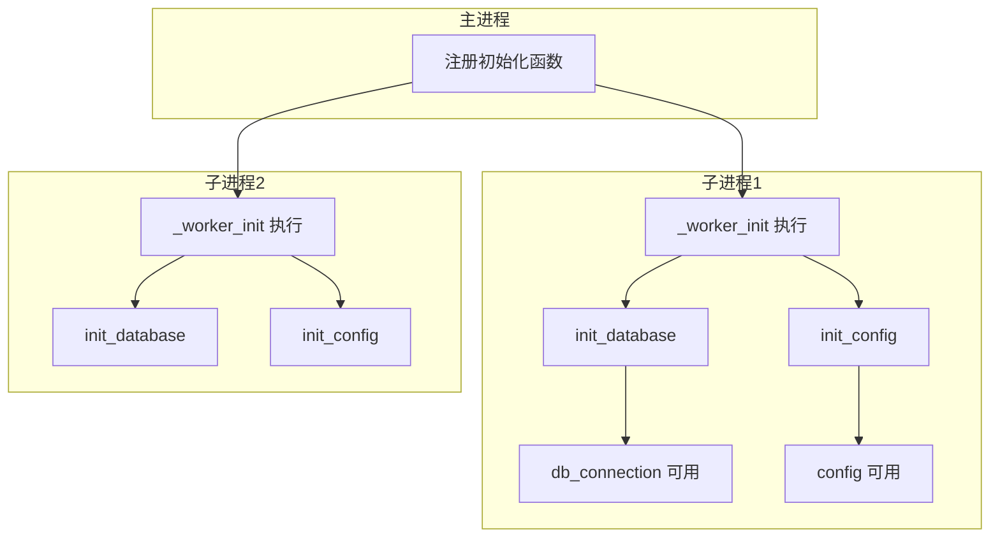

# Cellium 多进程教程

[中文](index.md)|[English](index.en.md)

## 教程

- [Component Tutorial](component-tutorial.en.md) | [组件开发教程](component-tutorial.md)
- [Multiprocessing Tutorial](multiprocessing-tutorial.en.md) | [多进程教程](multiprocessing-tutorial.md)
- [Event Mode Tutorial](event-mode-tutorial.en.md) | [事件模式教程](event-mode-tutorial.md)
- [Logging Tutorial](logging-tutorial.en.md) | [日志使用](logging-tutorial.md)

> **"CPU 有多个核心，为什么只用一个？让耗时任务在后台悄悄完成，不阻塞主界面。"**

本教程介绍 Cellium 的多进程功能，让你的组件能充分利用多核 CPU。

## 1. 为什么要用多进程？

| 场景 | 单进程 | 多进程 |
|------|--------|--------|
| 大量计算 | 界面卡死 | 界面流畅 |
| 耗时任务 | 等待完成 | 并行执行 |
| CPU 利用率 | 100% 一个核 | 100% 所有核 |

```python
# 普通函数 - 主进程执行，界面会卡住
def calculate_fibonacci(n):
    if n <= 1:
        return n
    return calculate_fibonacci(n-1) + calculate_fibonacci(n-2)

# 多进程函数 - 后台执行，界面不卡顿
@run_in_process
def calculate_fibonacci(n):
    if n <= 1:
        return n
    return calculate_fibonacci(n-1) + calculate_fibonacci(n-2)
```

## 2. 最简单的用法：@run_in_process 装饰器

给函数加上 `@run_in_process` 装饰器，它就会在子进程中执行。

### 示例：耗时计算不卡界面

```python
from app.core.util.mp_manager import run_in_process

# 普通函数（主进程执行）
def fibonacci(n):
    if n <= 1:
        return n
    return fibonacci(n-1) + fibonacci(n-2)

# 装饰后（子进程执行）
@run_in_process
def fibonacci_async(n):
    if n <= 1:
        return n
    return fibonacci_async(n-1) + fibonacci_async(n-2)

# 调用方式完全一样
result = fibonacci_async(35)  # 不会卡界面！
print(result)
```

### 效果对比

| 操作 | 普通函数 | @run_in_process |
|------|----------|-----------------|
| 调用方式 | `fibonacci(35)` | `fibonacci_async(35)` |
| 执行位置 | 主进程 | 子进程 |
| 界面状态 | 会卡顿 | 流畅响应 |

## 3. 异步版本：@run_in_process_async

如果需要在异步函数（async def）中使用，用 `@run_in_process_async`：

```python
import asyncio
from app.core.util.mp_manager import run_in_process_async

@run_in_process_async
def heavy_computation(data: str) -> str:
    # 耗时处理
    result = data * 1000000
    return f"处理完成: {len(result)} 字符"

async def main():
    # 在 async 函数中调用
    result = await heavy_computation("hello")
    print(result)

# 运行异步任务
asyncio.run(main())
```

## 4. 直接使用管理器

需要更多控制时，可以直接获取 `MultiprocessManager`：

```python
from app.core.util.mp_manager import get_multiprocess_manager

manager = get_multiprocess_manager()

# 同步执行
result = manager.submit(heavy_task, "参数1")

# 异步执行（返回 Future）
future = manager.submit_async(heavy_task, "参数1")
result = future.result()

# 批量执行
results = manager.map(task_function, [arg1, arg2, arg3, arg4])
```

### 管理器 API 速查

| 方法 | 说明 | 示例 |
|------|------|------|
| `submit(func, *args)` | 同步执行，返回结果 | `manager.submit(calc, 100)` |
| `submit_async(func, *args)` | 异步执行，返回 Future | `future = manager.submit_async(calc, 100)` |
| `map(func, args_list)` | 并行执行多个任务 | `results = manager.map(calc, [1,2,3])` |
| `shutdown()` | 关闭进程池 | `manager.shutdown()` |

## 5. 在组件中使用多进程

Calculator 组件已经使用了多进程：

```python
from app.core.util.mp_manager import run_in_process
from app.core.interface.icell import ICell

def _calculate_impl(expression: str) -> str:
    """纯函数：计算表达式（在子进程执行）"""
    sanitized = ''.join(c for c in expression if c in '0123456789+-*/.() ')
    result = eval(sanitized)
    return str(result)

class Calculator(ICell):
    mp_manager = injected(MultiprocessManager)
    
    def calculate(self, expression: str) -> str:
        """计算表达式（自动在子进程执行）"""
        return self.mp_manager.submit(_calculate_impl, expression)
```

### 执行流程



## 6. 子进程初始化：@worker_initializer

子进程是独立的，不能直接访问主进程的变量。如果需要在子进程中初始化资源，用 `@worker_initializer`：

```python
from app.core.util.mp_manager import worker_initializer, run_in_process

# 全局变量（在子进程中初始化）
db_connection = None
config = None

@worker_initializer
def init_database():
    """在每个子进程中执行：初始化数据库"""
    global db_connection
    db_connection = "已连接的数据库"
    print(f"数据库连接已创建: {db_connection}")

@worker_initializer
def init_config():
    """在每个子进程中执行：加载配置"""
    global config
    config = {"api_key": "xxx", "timeout": 30}
    print(f"配置已加载: {config}")

@run_in_process
def query_data(sql: str) -> str:
    """查询数据（可以直接使用子进程中的全局变量）"""
    global db_connection, config
    # ✅ 可以访问
    return f"使用 {db_connection} 执行: {sql}"
```

### 初始化流程



## 7. 注意事项

### 7.1 函数必须是可序列化的

传入子进程的函数和参数必须能被 pickle 序列化：

```python
# ❌ 错误：闭包不能序列化
def create_adder(x):
    def adder(y):
        return x + y
    return adder

# ✅ 正确：使用普通函数
def add(a, b):
    return a + b

# ✅ 正确：使用 lambda
add = lambda a, b: a + b
```

### 7.2 不能跨进程共享对象

```python
# ❌ 错误：不能共享同一个列表
shared_list = []

@run_in_process
def modify_list():
    shared_list.append(1)  # 子进程看不到这个列表

# ✅ 正确：通过参数传递
@run_in_process
def modify_list(data):
    data.append(1)
    return data
```

### 7.3 全局变量是独立的

```python
# 主进程
my_var = "主进程的值"

# 子进程
@run_in_process
def check_var():
    # 子进程有自己的 my_var 副本
    # 如果没有初始化，可能不是 "主进程的值"
    print(my_var)
```

## 8. 完整示例

完整的示例文件：`app/examples/multiprocessing_initializer_example.py`

```python
# -*- coding: utf-8 -*-
"""
多进程初始化示例
"""

import logging
from app.core.util.mp_manager import worker_initializer, run_in_process, get_multiprocess_manager

logging.basicConfig(level=logging.INFO, format='[%(levelname)s] %(message)s')
logger = logging.getLogger(__name__)

# 全局变量（在子进程中初始化）
db_connection = None
config = None

@worker_initializer
def init_database():
    global db_connection
    logger.info("[示例] 正在初始化数据库连接...")
    db_connection = "mock_db_connection"
    logger.info(f"[示例] 数据库连接已创建: {db_connection}")

@worker_initializer
def init_config():
    global config
    logger.info("[示例] 正在加载配置...")
    config = {"api_key": "secret", "timeout": 30}
    logger.info(f"[示例] 配置已加载: {config}")

@run_in_process
def process_data(data: str) -> str:
    """处理数据（使用子进程中的全局资源）"""
    global db_connection, config
    logger.info(f"[子进程] 处理数据: {data}")
    logger.info(f"[子进程] 数据库连接: {db_connection}")
    logger.info(f"[子进程] 配置: {config}")
    return f"processed_{data}"

if __name__ == "__main__":
    logger.info("[主进程] 启动...")
    result = process_data("test_data")
    logger.info(f"[主进程] 结果: {result}")
```

运行结果：

```
[主进程] 启动...
[示例] 正在初始化数据库连接...
[示例] 数据库连接已创建: mock_db_connection
[示例] 正在加载配置...
[示例] 配置已加载: {'api_key': 'secret', 'timeout': 30}
[子进程] 处理数据: test_data
[子进程] 数据库连接: mock_db_connection
[子进程] 配置: {'api_key': 'secret', 'timeout': 30}
[主进程] 结果: processed_test_data
```

## 9. 常见问题

**问：多进程什么时候自动启动？**

首次调用需要进程时自动启动（懒加载）。可以通过 `get_multiprocess_manager().executor` 手动获取。

**问：如何禁用多进程？**

```python
manager = get_multiprocess_manager()
manager.set_enabled(False)  # 所有任务将在主进程执行
```

**问：进程数量是多少？**

默认使用 `multiprocessing.cpu_count()` 个进程。你可以在创建 `ProcessPoolExecutor` 时指定 `max_workers`。

**问：程序退出时会发生什么？**

`atexit` 会自动调用 `shutdown()` 关闭进程池，确保资源释放。

**问：子进程出错怎么办？**

异常会通过 pickle 传回主进程。查看日志可以看到详细的错误信息。

## 10. 总结

| 场景 | 推荐用法 |
|------|----------|
| 简单的耗时计算 | `@run_in_process` |
| 异步函数中调用 | `@run_in_process_async` |
| 需要更多控制 | 直接使用 `MultiprocessManager` |
| 需要初始化资源 | `@worker_initializer` |

多进程让耗时任务在后台悄悄完成，用户体验更流畅！

<script type="module">
  import mermaid from 'https://cdn.jsdelivr.net/npm/mermaid@10/dist/mermaid.esm.min.mjs';
  // 初始化，并将所有 class 为 language-mermaid 的 pre 标签渲染为图表
  mermaid.initialize({ startOnLoad: true });
  
  // 针对 Jekyll 的兼容处理：Jekyll 默认生成的代码块 class 是 language-mermaid
  window.addEventListener('load', () => {
    const codeBlocks = document.querySelectorAll('pre code.language-mermaid');
    codeBlocks.forEach(codeBlock => {
      const pre = codeBlock.parentElement;
      pre.classList.add('mermaid');
      pre.textContent = codeBlock.textContent;
    });
  });
</script>